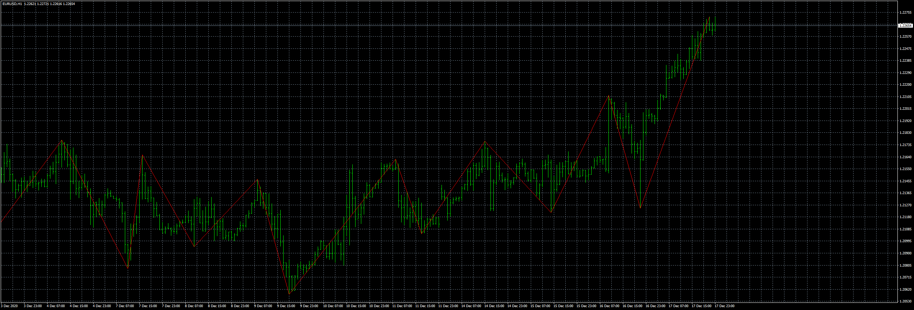
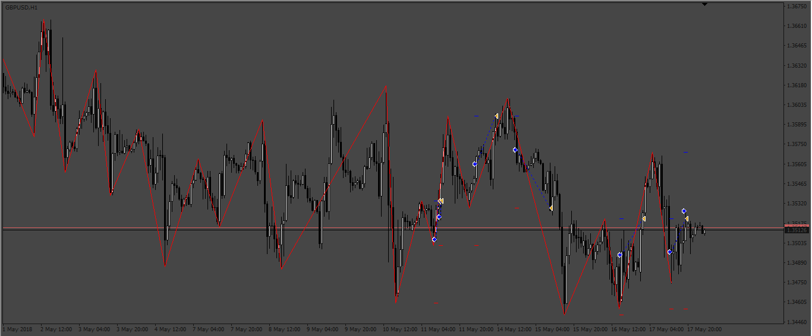
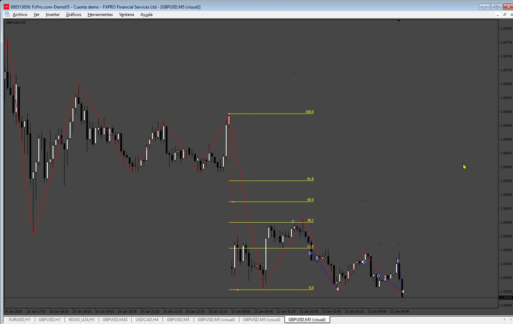
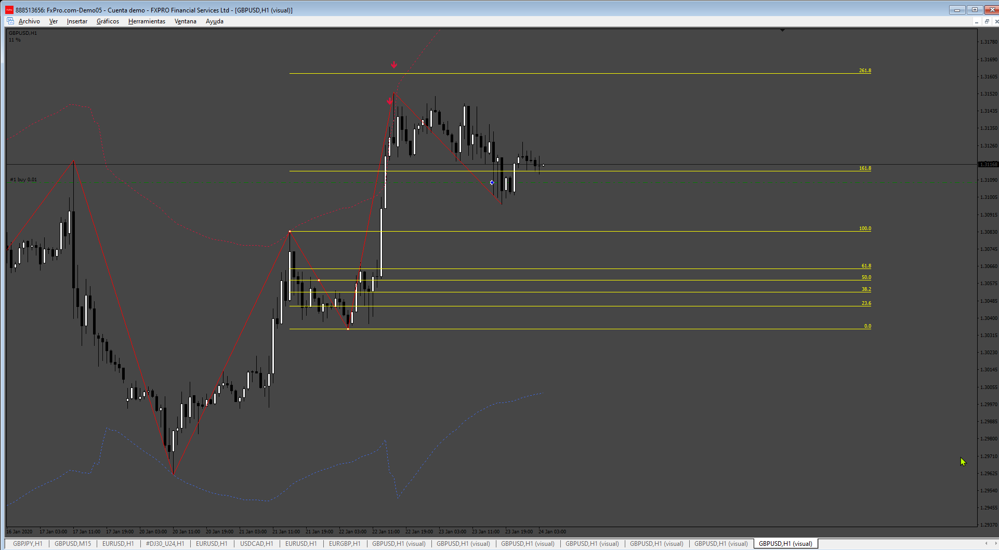
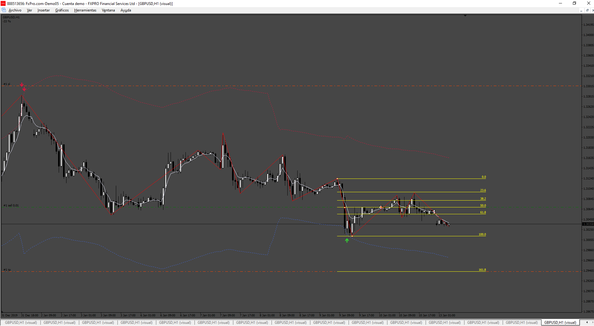
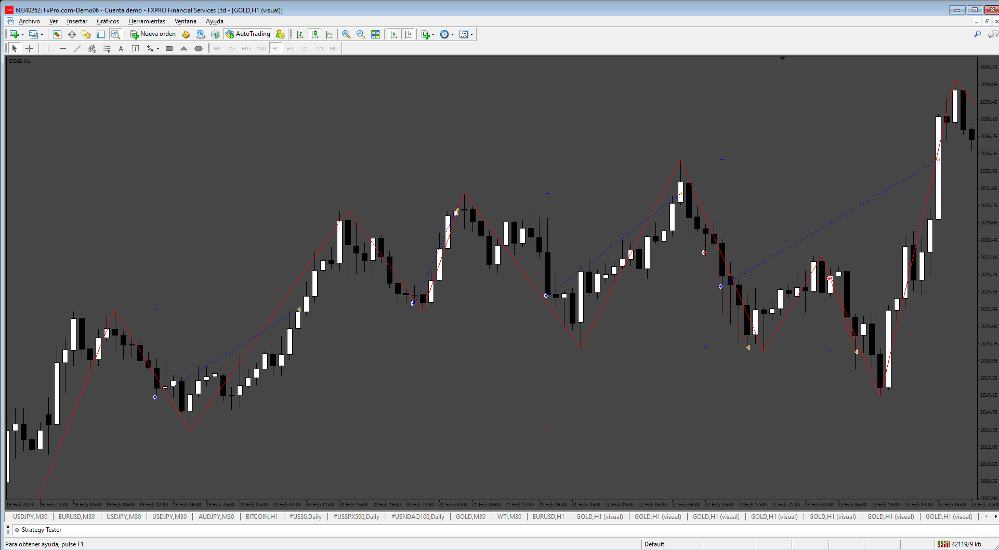

# EA with zigzag and fibo

> Source: https://fxcodebase.com/code/viewtopic.php?f=38&t=70940  
> Forum: 38 · Topic 70940 · 11 post(s)

---

## EA with zigzag and fibo

**Apprentice** · Fri Feb 19, 2021 12:58 pm

Based on the request.
[viewtopic.php?f=27&t=70917](https://fxcodebase.com/code/viewtopic.php?f=27&t=70917)

 [EA with zigzag and fibo.mq4](files/140829/EA%20with%20zigzag%20and%20fibo.mq4)

---

## EA_FiboZZ

**Apprentice** · Wed Oct 26, 2022 11:49 am

Based on the request.
[https://fxcodebase.com/code/viewtopic.php?f=27&t=70917](https://fxcodebase.com/code/viewtopic.php?f=27&t=70917)

 [EA_FiboZZ.mq4](files/148032/EA_FiboZZ.mq4)

 [EA_FiboZZ.mq5](files/148032/EA_FiboZZ.mq5)

---

## Re: EA_FiboZZ

**GreenT@1980** · Sun Aug 04, 2024 9:26 am

> **Apprentice wrote:**
>
>
> 652pic___.png
>
>
> Based on the request.
> [https://fxcodebase.com/code/viewtopic.php?f=27&t=70917](https://fxcodebase.com/code/viewtopic.php?f=27&t=70917)
>
>
> EA_FiboZZ.mq4
>
>
>
>
> EA_FiboZZ.mq5

Hi Sir,
Can u edit EA_FiboZZ.mq4 so that the user can set entry at 4 different entry level. In this case we can entry 4 positions at different levels. example position 1 at 161, position 2 at 261, and so on. Current EA only enter 1 position at 1 entry level.
Thanks.

---

## Re: EA with zigzag and fibo

**Apprentice** · Mon Aug 05, 2024 4:11 am

We have added your request to the development list.
Development reference 629

---

## Re: EA with zigzag and fibo

**Apprentice** · Fri Aug 16, 2024 5:46 pm

 [EA_FiboZZ_4_entrys.mq4](files/156455/EA_FiboZZ_4_entrys.mq4)

---

## Re: EA with zigzag and fibo

**GreenT@1980** · Sun Aug 18, 2024 10:16 am

Dear Apprentice,
Thanks a lot.

Is there any EA I can get base on Zigzag breakout+fibo?
After zigzag breakout, EA will open pending order at fibo level 161, 176, 261 & 276.
User will set TP and stop loss at certain fibo level. Once hit TP or stop loss, all open/pending order will be close.

---

## Re: EA with zigzag and fibo

**Apprentice** · Wed Aug 21, 2024 4:33 pm

We have added your request to the development list.
Development reference 668

---

## Re: EA with zigzag and fibo

**Apprentice** · Sun Aug 25, 2024 4:44 am

 

 [BO_ZZ_Fiibo_EA.mq4](files/156513/BO_ZZ_Fiibo_EA.mq4)

---

## Re: EA with zigzag and fibo

**GreenT@1980** · Mon Aug 26, 2024 7:49 am

Dear Apprentice,

This EA generate error with this message: SendNewOrder. Doaction cannot send order. Error: 130

---

## Re: EA with zigzag and fibo

**Apprentice** · Mon Aug 26, 2024 6:01 pm

We have added your request to the development list.
Development reference 675

---

## Re: EA with zigzag and fibo

**Apprentice** · Sun Aug 10, 2025 4:47 am

 [BO_ZZ_Fiibo_EA.mq4](files/160187/BO_ZZ_Fiibo_EA.mq4)
