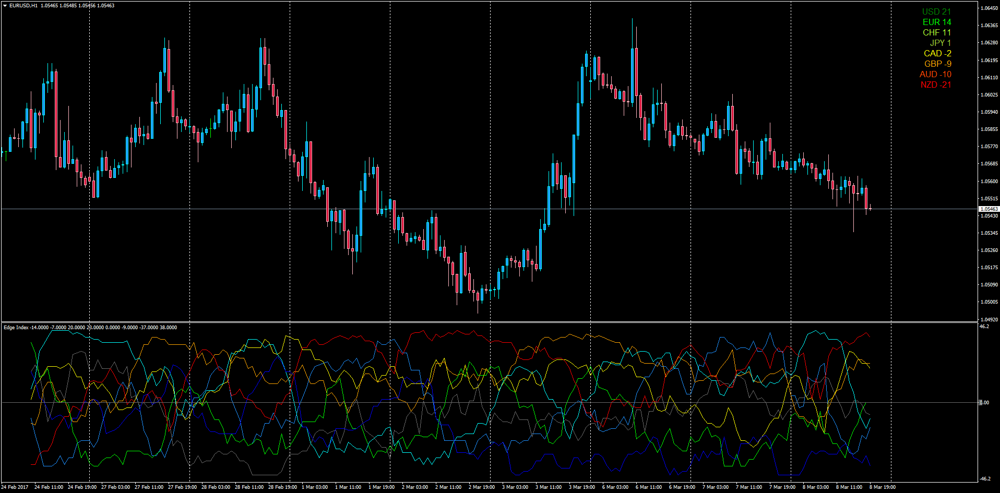

# Edge Index

> Source: https://fxcodebase.com/code/viewtopic.php?f=38&t=64510  
> Forum: 38 · Topic 64510 · 1 post(s)

---

## Edge Index

**Apprentice** · Wed Mar 08, 2017 2:11 pm

Requested MT4 version of the LUA original basket of 28 different pairs (combination of 8 different currencies) to determine the strenght index based on the following formula:

For each couple XXX:YYY the instruments are :

F = 8 EMA
M = 21 EMA
S = 55 EMA
R = ROC(8)
RS = ROC Signal (8 EMA)

IF F > M > S THEN XXX = +3 , YYY = -3
IF F < M > S THEN XXX = +2 , YYY = -1
IF F < M < S THEN XXX = -3 , YYY = +3
IF F > M < S THEN XXX = -1 , YYY = +2

IF R > RS > 0 LINE THEN XXX = +3 , YYY = -3
IF R < RS > 0 LINE THEN XXX = +2 , YYY = -1
IF R < RS < 0 LINE THEN XXX = -3 , YYY = +3
IF R > RS < 0 LINE THEN XXX = -1 , YYY = +2

For optimization purposes given the elevated use of simultaneous calculations, the oscillator code runs until a new bar appears and also the number of bars to be calculated is limited to the trader's preference.

The Labels on the top corner are calculated on each tick for the current bar which is the live index.

Note: ROC_with_Signal_MA.mq4 indicator should be installed in the indicators folder.
Found here: [viewtopic.php?f=38&t=64509](https://fxcodebase.com/code/viewtopic.php?f=38&t=64509)

 [Edge_Index.mq4](files/111369/Edge_Index.mq4)

 [Edge_Index_Sorted_Labels.mq4](files/111369/Edge_Index_Sorted_Labels.mq4)
