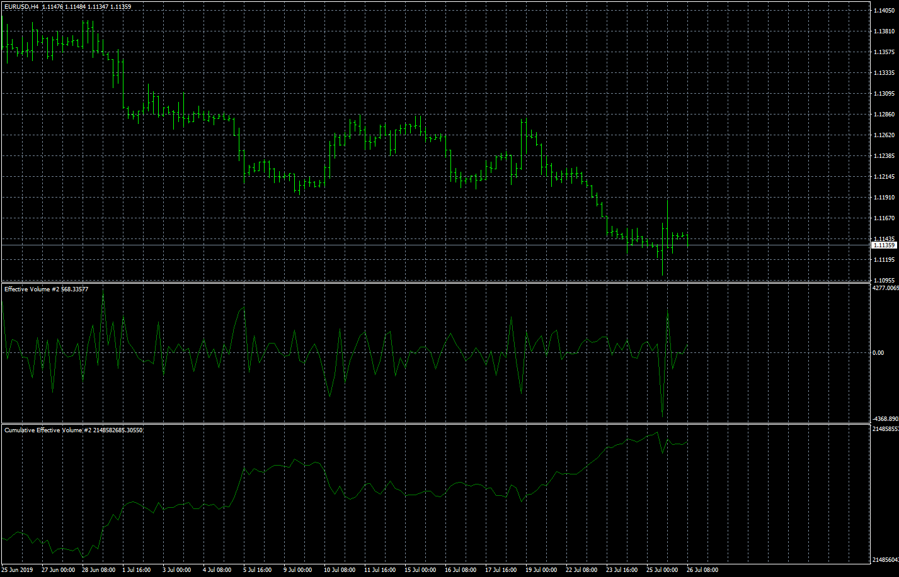
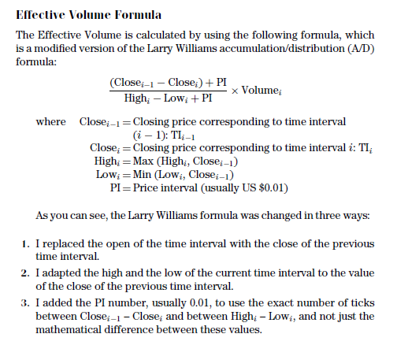

# Effective Volume

> Source: https://fxcodebase.com/code/viewtopic.php?f=38&t=68807  
> Forum: 38 · Topic 68807 · 6 post(s)

---

## Effective Volume

**Apprentice** · Sun Aug 18, 2019 8:43 am

Based on request.
[viewtopic.php?f=38&t=67194](https://fxcodebase.com/code/viewtopic.php?f=38&t=67194)

 [Effective Volume.mq4](files/127990/Effective%20Volume.mq4)

 [Cumulative Effective Volume.mq4](files/127990/Cumulative%20Effective%20Volume.mq4)

---

## Re: Effective Volume

**logicgate** · Sun Aug 18, 2019 9:09 am

Hello my dear friend. Still not correct. It does not look like the one in the book. Now it looks exactly like price, but inverted, practically 100% inverse correlation. Have you read the book and that article that I sent you? You just need to read chapter 1, and it is not long. Here in the article, as I told you, there is the implemented formula, and also tells you how to separate between Large Effective Volume and Small Effective Volume, which we also need.

The screenshots posted here in the article does not look like the indicator you coded:

[https://sharetips.ch/effective-volume/](https://sharetips.ch/effective-volume/)

Here the screenshots I took now, you can see it just mirrors price:

---

## Re: Effective Volume

**Apprentice** · Sun Aug 18, 2019 12:34 pm

Try it now.

 

Have used this formula.

---

## Re: Effective Volume

**logicgate** · Sun Aug 18, 2019 4:55 pm

> **Apprentice wrote:**
> Try it now.
>
>
> The attachment **Capture.PNG** is no longer available
>
>
> Have used this formula.

Still not right, there is something you might be missing... Use the formula from the article link now, and compare the screenshots. Aren´t you loading the indicators and comparing with the screenshots in the book for example? They don´t look anything like it... It is still an oscillator, take a look at screenshot I took now. Also, the cumulative version now just looks like an infinite downslope in whatever timeframe you load it in to.

---

## Re: Effective Volume

**Apprentice** · Mon Aug 19, 2019 2:30 am

Try it now.
Make sure to set PI to 0.
Otherwise, you will have eternal up sloops.

---

## Re: Effective Volume

**logicgate** · Mon Aug 19, 2019 10:06 pm

Hi there dear friend.

The indicators still look the same as before, the effective volume just looks like an oscillator, and the cumulative just mirrors price. I am gonna wait for you to study the indicators I posted for you check the code.

You also could try to turn this one here into cumulative mode so we can test if does it any good.
