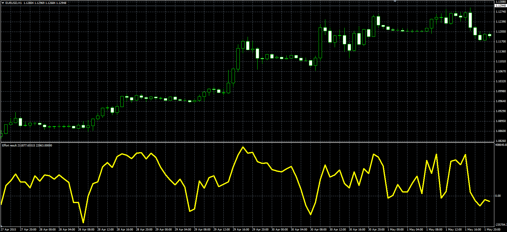

# Effort Result

> Source: https://fxcodebase.com/code/viewtopic.php?f=38&t=62199  
> Forum: 38 · Topic 62199 · 1 post(s)

---

## Effort Result

**Alexander.Gettinger** · Fri May 08, 2015 10:14 am

Original LUA oscillator: [viewtopic.php?f=17&t=62122](https://fxcodebase.com/code/viewtopic.php?f=17&t=62122).

Formula:
ER = ROC/MaxVol, where
ROC[i] = 100*(Price[i]/Price[i-Length]-1),
MaxVol - maximum volume at range from (i-Length+1) to (i).

 

Download:

 [Effort_Result.mq4](files/100360/Effort_Result.mq4)
