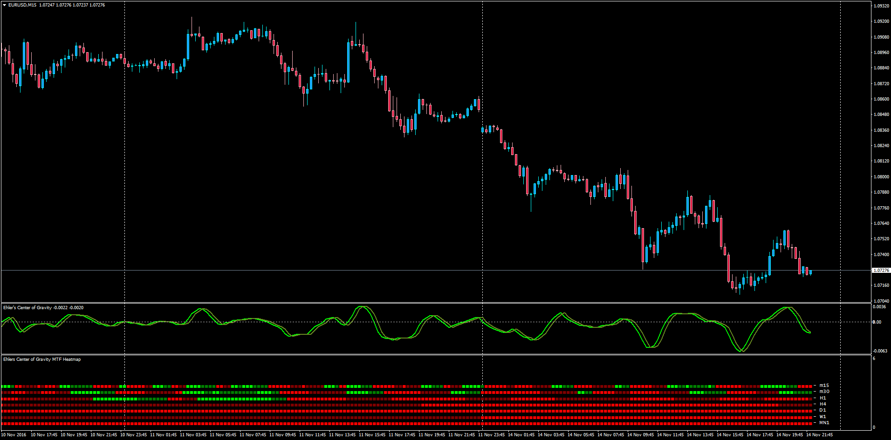

# Ehlers Center of Gravity + MTF Heatmap

> Source: https://fxcodebase.com/code/viewtopic.php?f=38&t=64099  
> Forum: 38 · Topic 64099 · 1 post(s)

---

## Ehlers Center of Gravity + MTF Heatmap

**Apprentice** · Tue Nov 15, 2016 3:52 am

LUA Original: [viewtopic.php?f=17&t=1617](https://fxcodebase.com/code/viewtopic.php?f=17&t=1617)

Description:

The COG oscillator is a John Ehler's FIR filer applied on the price. Center of Gravity actually has a zero lag and allows to define turning points precisely. This indicator is the result of Ehler's study of adaptive filters. The indicator Center of Gravity allows to identify main pivot points almost without any lag as well.

Multi Time Frame Heatmap (requires Ehlers_CG.mq4):

This visual subwindow has been developed to help see the trader the oscillations of the center of gravity in all the different time frames:

Colors are as follows:

CG > 0 and CG0 > CG1 = Lime;
CG > 0 and CG0 < CG1 = Green;
CG < 0 and CG0 < CG1 = Red;
CG < 0 and CG0 > CG1 = Maroon;

 [Ehlers_CG.mq4](files/109081/Ehlers_CG.mq4)

 [Ehlers_CG_MTF_Heatmap.mq4](files/109081/Ehlers_CG_MTF_Heatmap.mq4)
