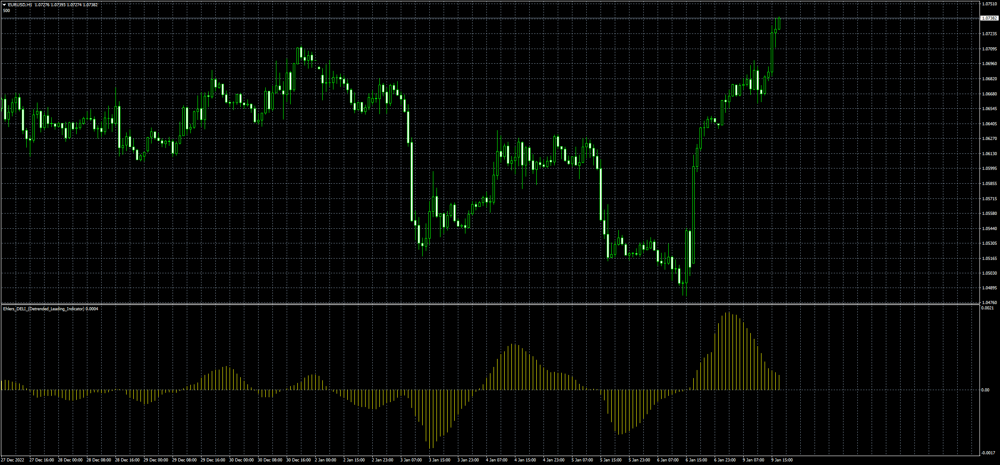

# Ehlers_DELI_(Detrended_Leading_Indicator)

> Source: https://fxcodebase.com/code/viewtopic.php?f=38&t=73153  
> Forum: 38 · Topic 73153 · 4 post(s)

---

## Ehlers_DELI_(Detrended_Leading_Indicator)

**Apprentice** · Mon Jan 09, 2023 10:11 am

Based on the request.
[https://fxcodebase.com/code/viewtopic.php?f=17&t=73074](https://fxcodebase.com/code/viewtopic.php?f=17&t=73074)

 [Ehlers_DELI_(Detrended_Leading_Indicator).mq4](files/148981/Ehlers_DELI_%28Detrended_Leading_Indicator%29.mq4)

TS2 version.
[https://fxcodebase.com/code/viewtopic.php?f=17&t=73955](https://fxcodebase.com/code/viewtopic.php?f=17&t=73955)

---

## Re: Ehlers_DELI_(Detrended_Leading_Indicator)

**xristos1982** · Wed Jul 19, 2023 2:35 pm

Can I have this in Lua please?

---

## Re: Ehlers_DELI_(Detrended_Leading_Indicator)

**Apprentice** · Thu Jul 20, 2023 1:58 pm

We have added your request to the development list.
Development reference 618.

---

## Re: Ehlers_DELI_(Detrended_Leading_Indicator)

**Apprentice** · Thu Jul 20, 2023 3:19 pm

TS2 version.
[https://fxcodebase.com/code/viewtopic.php?f=17&t=73955](https://fxcodebase.com/code/viewtopic.php?f=17&t=73955)
