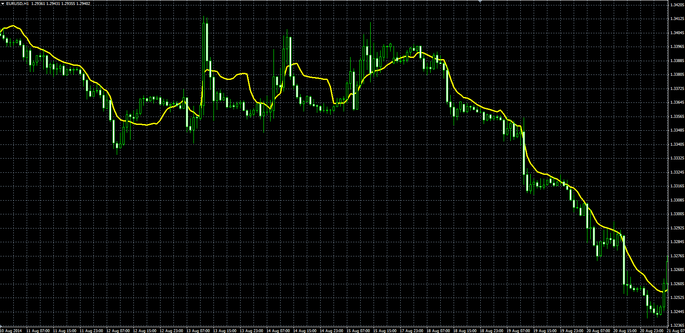

# Ehlers Filter

> Source: https://fxcodebase.com/code/viewtopic.php?f=38&t=61132  
> Forum: 38 · Topic 61132 · 1 post(s)

---

## Ehlers Filter

**Alexander.Gettinger** · Fri Sep 12, 2014 3:40 pm

Original LUA indicators: [viewtopic.php?f=17&t=33433](https://fxcodebase.com/code/viewtopic.php?f=17&t=33433).

Formulas:
EF = MVA(PriceCoeff)/MVA(Coeff), where
PriceCoeff[i] = Coeff[i]*Price[i],
Coeff[i] = Abs(Price[i]-Price[i-Momentum]),
Abs - absolute value,
MVA - simple moving average with [Length] number of periods.

 

Download:

 [EF.mq4](files/95844/EF.mq4)

 [NEF.mq4](files/95844/NEF.mq4)
