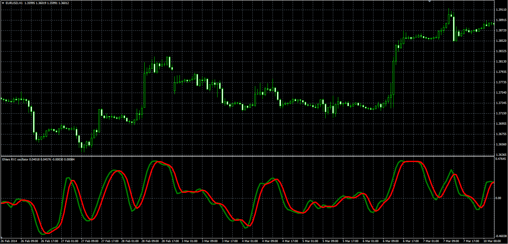

# Ehlers RVI oscillator

> Source: https://fxcodebase.com/code/viewtopic.php?f=38&t=60771  
> Forum: 38 · Topic 60771 · 1 post(s)

---

## Ehlers RVI oscillator

**Alexander.Gettinger** · Wed Jun 04, 2014 5:29 pm

Original LUA oscillator: [viewtopic.php?f=17&t=1735](https://fxcodebase.com/code/viewtopic.php?f=17&t=1735).

Formulas:
RVI[i] = Num/Demon,
Signal[i] = (RVI[i]+2*RVI[i-1]+2*RVI[i-2]+RVI[i-3])/6, where
Num = MVA(Value1, Length),
Demon = MVA(Value2, Length),
Value1[i] = ((Close[i]-Open[i])+2*(Close[i-1]-Open[i-1])+2*(Close[i-2]-Open[i-2])+(Close[i-3]-Open[i-3]))/6,
Value2[i] = ((High[i]-Low[i])+2*(High[i-1]-Low[i-1])+2*(High[i-2]-Low[i-2])+(High[i-3]-Low[i-3]))/6.

 

Download:

 [ERVI.mq4](files/94310/ERVI.mq4)
