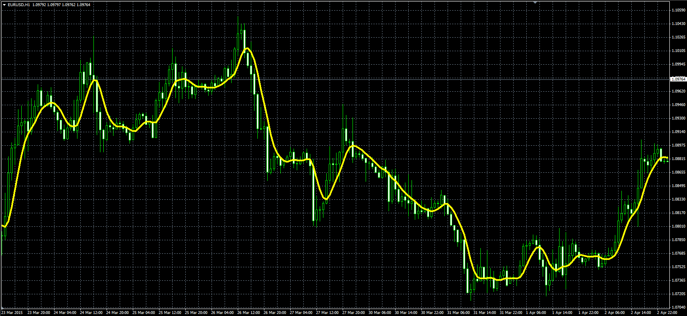

# Ehlers SuperSmoother

> Source: https://fxcodebase.com/code/viewtopic.php?f=38&t=62162  
> Forum: 38 · Topic 62162 · 1 post(s)

---

## Ehlers SuperSmoother

**Alexander.Gettinger** · Wed Apr 29, 2015 1:22 pm

Original LUA indicator: [viewtopic.php?f=17&t=61032](https://fxcodebase.com/code/viewtopic.php?f=17&t=61032).

Formula:
SS[i] = c1*(Price[i]+Price[i-1])/2+c2*SS[i-1]+c3*SS[i-2], where
c1, c2, c3 - constant coefficients.

 

Download:

 [Super_Smoother.mq4](files/100147/Super_Smoother.mq4)
