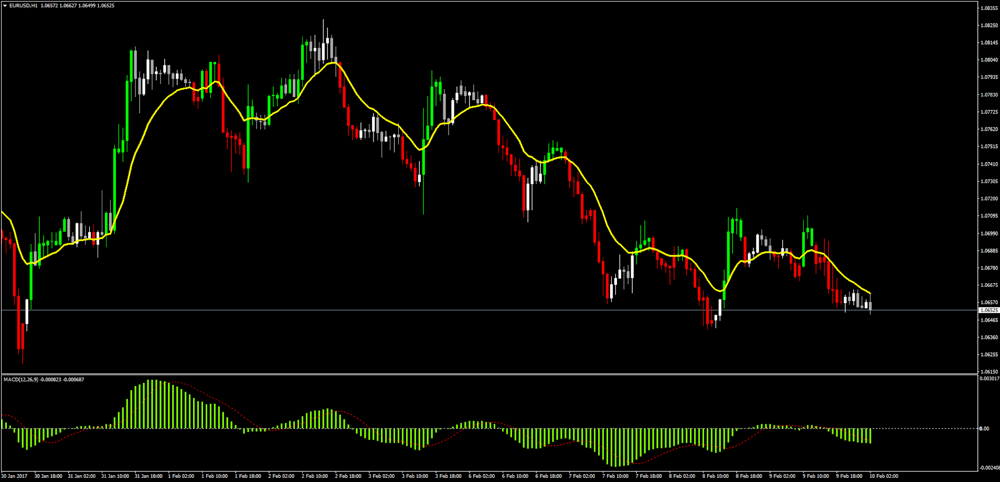

# Elder Impulse System Overlay

> Source: https://fxcodebase.com/code/viewtopic.php?f=38&t=64430  
> Forum: 38 · Topic 64430 · 5 post(s)

---

## Elder Impulse System Overlay

**Apprentice** · Fri Feb 10, 2017 3:38 am

TS2/Marketscope/Lua Version
[viewtopic.php?f=17&t=63380](https://fxcodebase.com/code/viewtopic.php?f=17&t=63380)
Description:
Candles Color Overlay according to the following conditions:

Bullish:

- Current EMA > Previous EMA
- Current MACD Histogram > Previous MACD Histogram

Opposite for bearish.

Note: Since the request mentions that the trader is used to the LUA version, the MACD histogram in MT4 has been adapted to LUA's way, which is the MACD/Signal difference. Eitherway, both way can be calculated in the indicator options.

 [Elder_Impulse_System_Overlay.mq4](files/110983/Elder_Impulse_System_Overlay.mq4)

---

## Re: Elder Impulse System Overlay

**BadTunaSalad** · Tue Feb 21, 2017 1:28 am

Just saw this, thank you very much! Works great!

---

## Re: Elder Impulse System Overlay

**jimmylai** · Mon Jul 15, 2019 2:28 am

Dear Apprentice ,

Regarding the Elder Impulse System Overlay, Look like the MACD calculation is based on SMA. May I ask to make it changeable for the MACD? i.e. it can be SMA, EMA, etc.

Many thanks.

---

## Re: Elder Impulse System Overlay

**Apprentice** · Mon Jul 15, 2019 8:01 am

Your request is added to the development list under Id Number 4784

---

## Re: Elder Impulse System Overlay

**Apprentice** · Wed Jul 17, 2019 6:31 am

Try this version.

 [Elder_Impulse_System_Overlay.mq4](files/127388/Elder_Impulse_System_Overlay.mq4)
