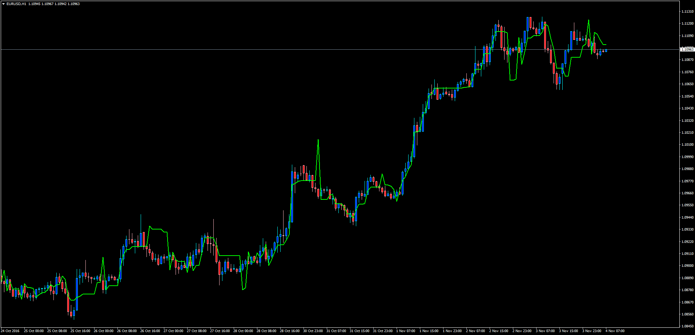
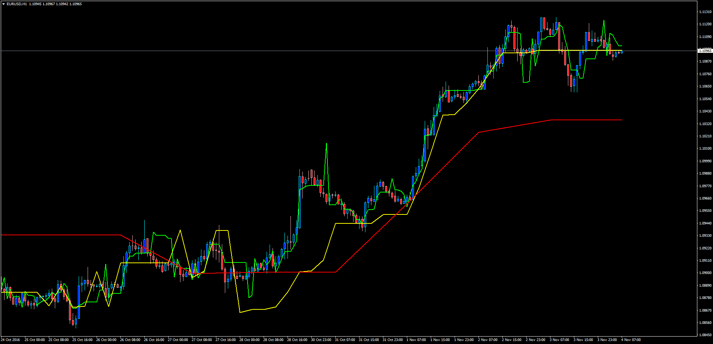
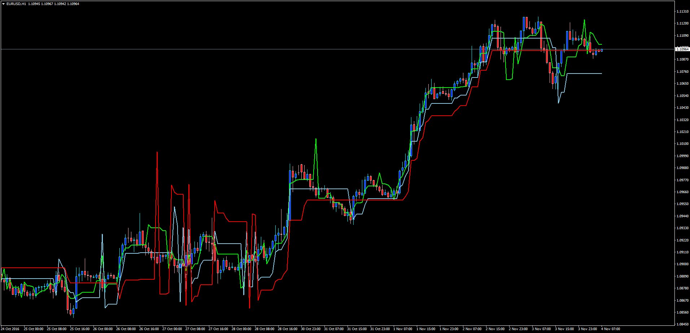

# Elder's Safe Zone (Single, Triple and MTF)

> Source: https://fxcodebase.com/code/viewtopic.php?f=38&t=64055  
> Forum: 38 · Topic 64055 · 1 post(s)

---

## Elder's Safe Zone (Single, Triple and MTF)

**Apprentice** · Fri Nov 04, 2016 2:37 am

 

 

LUA Original: [viewtopic.php?f=17&t=1158](https://fxcodebase.com/code/viewtopic.php?f=17&t=1158)

Description:

Elder's Safezone Stops identifies stop loss exit points for long and short positions. This indicator is designed to aid in stop loss exit decisions

- Elders_Safe_Zone.mq4: Original Indicator for Single TF.
- Elders_Safe_Zone_Triple.mq4: Let the user play with the parameters of 3 different ESZ lines
- Elders Safe_Zone_MTF.mq4: This one allow the user to see the current TF and also 2 additional bigger Time Frames at the same time. Very useful to identify also ranging periods.

 [Elders_Safe_Zone.mq4](files/108906/Elders_Safe_Zone.mq4)

 [Elders_Safe_Zone_MTF.mq4](files/108906/Elders_Safe_Zone_MTF.mq4)

 [Elders_Safe_Zone_Triple.mq4](files/108906/Elders_Safe_Zone_Triple.mq4)
