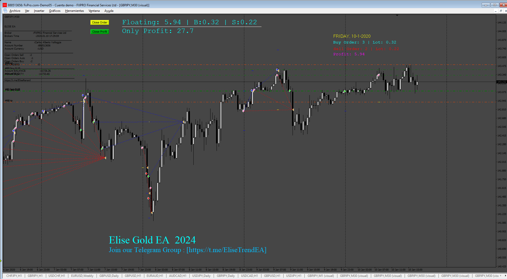
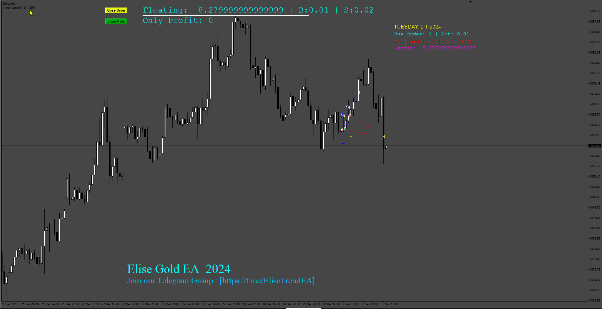

# Elise-EA

> Source: https://fxcodebase.com/code/viewtopic.php?f=38&t=75311  
> Forum: 38 · Topic 75311 · 6 post(s)

---

## Elise-EA

**Apprentice** · Sat Oct 26, 2024 6:05 am

Based on the request.
[https://fxcodebase.com/code/viewtopic.php?f=38&t=75278](https://fxcodebase.com/code/viewtopic.php?f=38&t=75278)

 [Elise-EA.mq4](files/157080/Elise-EA.mq4)

---

## Re: Elise-EA

**shakir1990** · Tue May 20, 2025 4:06 am

Hi Apprentice, can add start time and end time for trading, so can manually choose when to start and end trading. thanks

---

## Re: Elise-EA

**Apprentice** · Sat May 24, 2025 2:50 pm

We have added your request to the development list.
Development reference 355

---

## Re: Elise-EA

**shakir1990** · Mon May 26, 2025 11:07 am

hi sir, 1 more request, can convert this file to mq5. thanks.

---

## Re: Elise-EA

**Apprentice** · Sun Aug 10, 2025 4:34 am

 [Elise_EA.mq4](files/160182/Elise_EA.mq4)

---

## Re: Elise-EA

**Apprentice** · Thu Nov 06, 2025 7:25 am

[Elise_EA.mq5](files/161149/Elise_EA.mq5)
