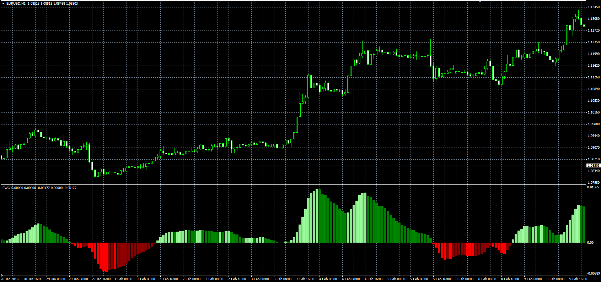

# Elliot Wave Oscillator

> Source: https://fxcodebase.com/code/viewtopic.php?f=38&t=63204  
> Forum: 38 · Topic 63204 · 14 post(s)

---

## Elliot Wave Oscillator

**Alexander.Gettinger** · Wed Mar 02, 2016 1:52 pm

Download:

 [EWO.mq4](files/105067/EWO.mq4)

 [EWO heat map.mq4](files/105067/EWO%20heat%20map.mq4)

---

## Re: Elliot Wave Oscillator

**amazon1a** · Thu Jul 16, 2020 4:47 pm

Hi Apprentice,

Thanks for the EWO Heat Map, MQ4. But also I would like to be able to select the Time Frames displayed and have them labelled to the Right of the line as is frequently the case with some other indis. 5 lines works fine for me.

Can you also add Price Source and Smoothing Method just like the .lua version?

I do not understand why you have 5 preset Pairs? I presume the Indi reads any Pair on the screen.

Best, AG

---

## Re: Elliot Wave Oscillator

**Apprentice** · Fri Jul 17, 2020 4:32 am

Your request is added to the development list.
Development reference 1715.

---

## Re: Elliot Wave Oscillator

**Apprentice** · Wed Jul 29, 2020 4:31 pm

[EWO heat map.mq4](files/136409/EWO%20heat%20map.mq4)

Try this version.

---

## Re: Elliot Wave Oscillator

**amazon1a** · Fri Aug 28, 2020 9:30 am

Hi Apprentice,

Thanks for this version, but it is not exactly what I had in mind. Could you modify it?

1. I would like to have MTFs of the current Chart pair - not just selected pairs
 Maybe add a choice for Chart pair or Selected pairs.
 Also, the current version does not respond to changing the TFs - but it will change the pairs

2. Maybe Font selections for the indi labels and set away from the lines a couple of spaces

Many thanks, AG

---

## Re: Elliot Wave Oscillator

**Apprentice** · Sat Aug 29, 2020 10:49 am

Your request is added to the development list.
Development reference 1945.

---

## Re: Elliot Wave Oscillator

**Apprentice** · Wed Sep 02, 2020 3:18 am

[EWO heat map.mq4](files/137247/EWO%20heat%20map.mq4)

MT4 doesn't allow to select the font size for that stream

---

## Re: Elliot Wave Oscillator

**amazon1a** · Wed Sep 02, 2020 9:35 am

Hi Apprentice,

Thanks for your recent version - we are definitely getting closer. The functionality is great.

But now:

1. The colors for Ups and Downs etc seem to be inverted .. Dull should be Bright - see the EWO osc for example - I tried to flip using MT4 editor, but could not do it. The example below is set for all lines on H4 just for convenience. The selectors work fine.

2. I was able to change the Font and color for the labels on each line, but can you give me a couple of spaces, like the MTF HA Bar example, between the last block and the label?

 [30394](files/137254/09-02%20FxCode%20EWO%20compare.jpg)

Regards, AG

---

## Re: Elliot Wave Oscillator

**Apprentice** · Thu Sep 03, 2020 1:58 am

Your request is added to the development list.
Development reference 1967.

---

## Re: Elliot Wave Oscillator

**Apprentice** · Thu Sep 10, 2020 2:15 am

[EWO_heat_map.mq4](files/137508/EWO_heat_map.mq4)

Try this version.

---

## Re: Elliot Wave Oscillator

**amazon1a** · Thu Sep 10, 2020 9:17 am

> **Apprentice wrote:**
>
>
> EWO_heat_map.mq4
>
>
> Try this version.

Thanks Apprentice, This is exactly what I was looking for.

Best, AG

---

## Re: Elliot Wave Oscillator

**sandrolmp** · Wed Oct 21, 2020 9:59 am

is it possible to display divergenves on EWO?

---

## Re: Elliot Wave Oscillator

**Apprentice** · Thu Oct 22, 2020 1:55 am

Your request is added to the development list.
Development reference 2209.

---

## Re: Elliot Wave Oscillator

**Apprentice** · Mon Oct 26, 2020 4:23 am

[EWO_heat_map_ver1.mq4](files/138476/EWO_heat_map_ver1.mq4)

Try this version.
