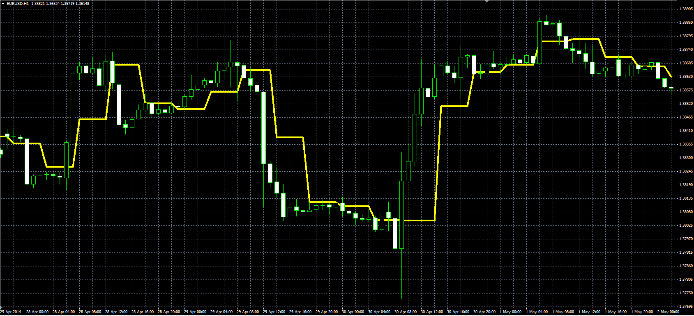

# Elsig’s Shifting Mean indicator

> Source: https://fxcodebase.com/code/viewtopic.php?f=38&t=60785  
> Forum: 38 · Topic 60785 · 1 post(s)

---

## Elsig’s Shifting Mean indicator

**Alexander.Gettinger** · Thu Jun 05, 2014 10:12 am

Original LUA indicator: [viewtopic.php?f=17&t=60593](https://fxcodebase.com/code/viewtopic.php?f=17&t=60593).

Formula:
ESM[i] = (Min+Max)/2, where
Min, Max - minimum and maximum prices at range from (index-Length+1) to (index),
index - start bar of current segment.

 

Download:

 [Elsigs_Shifting_Mean.mq4](files/94344/Elsigs_Shifting_Mean.mq4)
