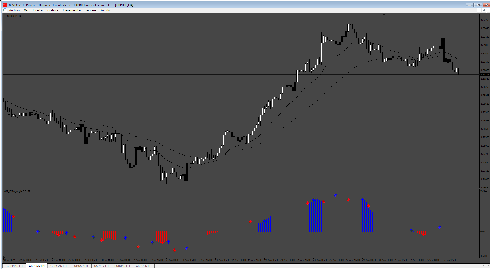

# EMA_Angle

> Source: https://fxcodebase.com/code/viewtopic.php?f=38&t=75198  
> Forum: 38 · Topic 75198 · 6 post(s)

---

## EMA_Angle

**Apprentice** · Tue Sep 10, 2024 11:37 am

Based on the request.
[https://fxcodebase.com/code/viewtopic.p ... 82#p156582](https://fxcodebase.com/code/viewtopic.php?f=17&p=156582#p156582)

 [EMA_Angle.mq4](files/156644/EMA_Angle.mq4)

---

## Re: EMA_Angle

**aarkay** · Wed Sep 11, 2024 3:35 am

Dear Apprentice,

Thanks a lot for the modifications.

However the EA is not able to pick up the buffer numbers to enter trades. I identified them as Buy=2, Sell=3.

Could you kindly see that the EA identifies it as a signal as soon as the arrow appears?

- Aarkay

---

## Re: EMA_Angle

**aarkay** · Wed Sep 11, 2024 4:11 am

Hi Apprentice,

Another issue I am finding is that the Histograms of the earlier version and the New version are not similar.

Could you kindly see to it that the histogram is as per the earlier one? The latest one seems very delayed.

---

## Re: EMA_Angle

**Apprentice** · Sat Sep 14, 2024 3:45 am

We have added your request to the development list.
Development reference 713

---

## Re: EMA_Angle

**aarkay** · Thu Oct 10, 2024 9:12 am

Dear Apprentice,

I have not got what I wanted. But I still donated.

Please inform me if my request will be done or not.

Thanks and regards

- aarkay

---

## Re: EMA_Angle

**Apprentice** · Tue Oct 22, 2024 11:18 am

[EMA_Angle_v2.mq4](files/157042/EMA_Angle_v2.mq4)

Try this version.
