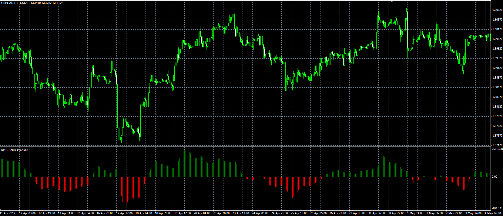

# EMA Angle

> Source: https://fxcodebase.com/code/viewtopic.php?f=38&t=17982  
> Forum: 38 · Topic 17982 · 1 post(s)

---

## EMA Angle

**Alexander.Gettinger** · Tue May 08, 2012 5:09 pm

Original indicator: [viewtopic.php?f=17&t=1294&p=28589](https://fxcodebase.com/code/viewtopic.php?f=17&t=1294&p=28589)

Formula:
Angle[i]=(EMA[i]-EMA[i-Shift])/pipSize.
If Angle>=Treshold - UP,
if Angle<=-Trreshold - DN.

 

Download:

 [EMA_Angle.mq4](files/32537/EMA_Angle.mq4)
