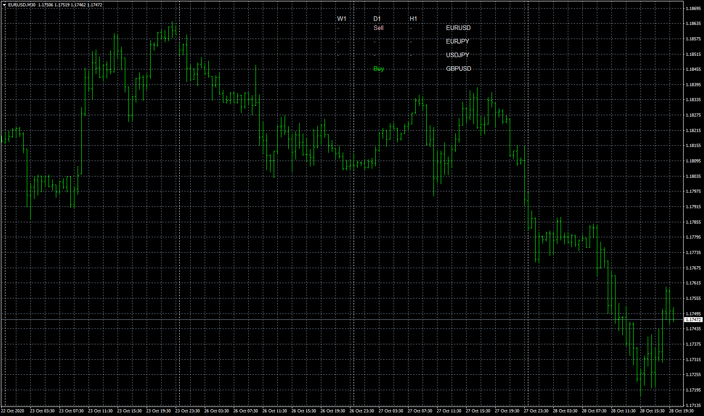

# EMA_Bounce_ver1

> Source: https://fxcodebase.com/code/viewtopic.php?f=38&t=70566  
> Forum: 38 · Topic 70566 · 5 post(s)

---

## EMA_Bounce_ver1

**Apprentice** · Mon Oct 26, 2020 4:37 am

Based on request.
[viewtopic.php?f=27&t=70112&start=10](https://fxcodebase.com/code/viewtopic.php?f=27&t=70112&start=10)

 [EMA_Bounce_ver1.mq4](files/138477/EMA_Bounce_ver1.mq4)

 [EMA_Bounce_Dashboard.mq4](files/138477/EMA_Bounce_Dashboard.mq4)

---

## Re: EMA_Bounce_ver1

**TheYoda** · Mon Oct 26, 2020 1:57 pm

**Thanks a lot Apprentice.** I was asking for a dashboard, not an indicator, I'm so sorry if I didn't make that clear enough in the initial request. Would the dashboard be a possibility?

---

## Re: EMA_Bounce_ver1

**Apprentice** · Tue Oct 27, 2020 7:25 am

The request was clear.
Developers have misunderstood.
Have created a dashboard request.

---

## Re: EMA_Bounce_ver1

**Apprentice** · Wed Oct 28, 2020 12:24 pm

EMA_Bounce_Dashboard.mq4 added.

---

## Re: EMA_Bounce_ver1

**TheYoda** · Sat Oct 31, 2020 5:09 pm

Thank you , thank you, you are far too kind. I'm going to give you feedback .
