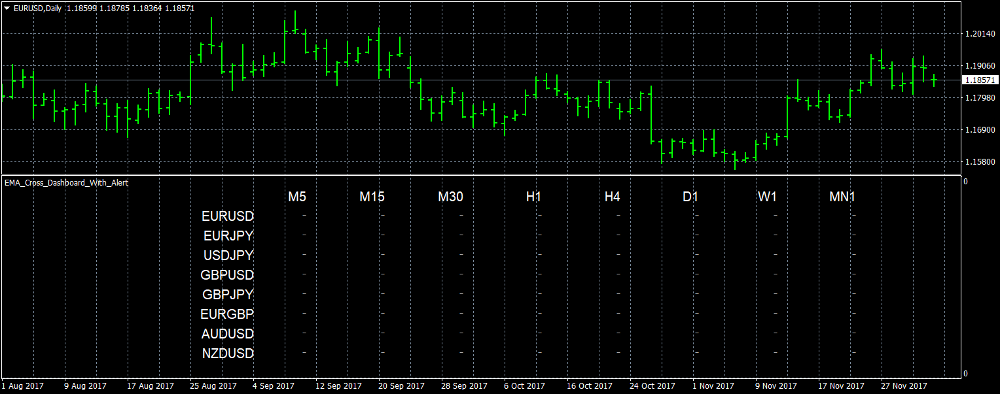

# EMA_Cross_Dashboard_With_Alert

> Source: https://fxcodebase.com/code/viewtopic.php?f=38&t=65431  
> Forum: 38 · Topic 65431 · 13 post(s)

---

## EMA_Cross_Dashboard_With_Alert

**Apprentice** · Mon Dec 04, 2017 6:40 am

TS2/Markescope/Lua version.
[viewtopic.php?f=17&t=65383](https://fxcodebase.com/code/viewtopic.php?f=17&t=65383)

 [EMA_Cross_Dashboard_With_Alert.mq4](files/116351/EMA_Cross_Dashboard_With_Alert.mq4)

---

## Re: EMA_Cross_Dashboard_With_Alert

**seunboi4u** · Mon Dec 04, 2017 6:54 am

Hello sir thanks for the MT4 solution....please i want to ask if possible to add 1min time frame and also add SMA.....or you can make separate SMA with also 1min time frame Thanks God bless you sir

---

## Re: EMA_Cross_Dashboard_With_Alert

**Apprentice** · Tue Dec 05, 2017 4:36 am

Try it now.

---

## Re: EMA_Cross_Dashboard_With_Alert

**seunboi4u** · Thu Jan 04, 2018 5:44 am

> **Apprentice wrote:**
> Try it now.

God bless you Boss i really love it sir.........please can it possible to make something like this for MACD ?

---

## Re: EMA_Cross_Dashboard_With_Alert

**Apprentice** · Mon Jan 08, 2018 5:47 am

Your request is added to the development list under Id Number 4002

---

## Re: EMA_Cross_Dashboard_With_Alert

**Apprentice** · Tue Jan 09, 2018 6:15 am

Try this version.
[viewtopic.php?f=38&t=65616&p=116929#p116929](https://fxcodebase.com/code/viewtopic.php?f=38&t=65616&p=116929#p116929)

---

## Re: EMA_Cross_Dashboard_With_Alert

**Stomp2k** · Wed Dec 04, 2019 7:17 am

I have downloaded the EMA_Cross_Dashboard_With_Alert for mt4
Very beneficial.

Is it possible to code in Push Notification Alert for mt4 version?

and can the dashboard font size or cells either be made smaller to fit all 28 major pairs in 1 window, or to make the window enabled to scroll up/down.

---

## Re: EMA_Cross_Dashboard_With_Alert

**Apprentice** · Wed Dec 04, 2019 4:30 pm

Your request is added to the development list.
Development reference 392.

---

## Re: EMA_Cross_Dashboard_With_Alert

**Apprentice** · Thu Dec 05, 2019 6:51 am

[EMA_Cross_Dashboard_With_Alert.mq4](files/130083/EMA_Cross_Dashboard_With_Alert.mq4)

Try this version.

---

## Re: EMA_Cross_Dashboard_With_Alert

**Stomp2k** · Sat Dec 07, 2019 10:09 pm

awesome, thank you

---

## Re: EMA_Cross_Dashboard_With_Alert

**TheYoda** · Wed Dec 22, 2021 12:48 pm

> **Apprentice wrote:**
>
>
> The attachment **EMA_Cross_Dashboard_With_Alert.mq4** is no longer available
>
>
> Try this version.

Hi Apprentice , Can you modify this indicator ? I'd like it to attach to the main screen and not sub-window.

Thanks.

---

## Re: EMA_Cross_Dashboard_With_Alert

**Apprentice** · Thu Dec 23, 2021 3:01 am

Your request is added to the development list.
Development reference 1031.

---

## Re: EMA_Cross_Dashboard_With_Alert

**Apprentice** · Tue Feb 01, 2022 4:18 am

[EMA_Cross_Dashboard_With_Alert.mq4](files/144907/EMA_Cross_Dashboard_With_Alert.mq4)

Try this version.
