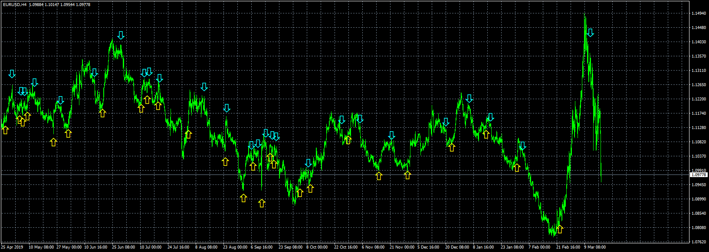

# EMA_Crossover_MTF_Indicator

> Source: https://fxcodebase.com/code/viewtopic.php?f=38&t=69923  
> Forum: 38 · Topic 69923 · 13 post(s)

---

## EMA_Crossover_MTF_Indicator

**Apprentice** · Tue May 26, 2020 11:55 am

Based on request.
[viewtopic.php?f=27&t=69888](https://fxcodebase.com/code/viewtopic.php?f=27&t=69888)

 [EMA_Crossover_MTF_Indicator.mq4](files/134324/EMA_Crossover_MTF_Indicator.mq4)

 [EMA_Cross_RSI_Trend_Spotter_BTF.mq4](files/134324/EMA_Cross_RSI_Trend_Spotter_BTF.mq4)

---

## Re: EMA_Crossover_MTF_Indicator

**xmohammad** · Fri Jun 12, 2020 2:00 pm

> **Apprentice wrote:**
>
>
> eurusd-h4-fxcm-australia-pty.png
>
>
> Based on request.
> [viewtopic.php?f=27&t=69888](https://fxcodebase.com/code/viewtopic.php?f=27&t=69888)
>
>
> EMA_Crossover_MTF_Indicator.mq4

Do you know the NRP version OF This or like This ?

---

## Re: EMA_Crossover_MTF_Indicator

**Apprentice** · Sun Jun 14, 2020 7:27 pm

Unfortunately no.

---

## Re: EMA_Crossover_MTF_Indicator

**xmohammad** · Tue Aug 04, 2020 9:35 am

Request Development
Simple MTF without dashboard

---

## Re: EMA_Crossover_MTF_Indicator

**Apprentice** · Wed Aug 05, 2020 4:18 am

Your request is added to the development list.
Development reference 1831.

---

## Re: EMA_Crossover_MTF_Indicator

**xmohammad** · Wed Aug 05, 2020 8:40 am

request Special development
To find faster the best settings for this indicator, I need a simple panel with 3 options to increase or decrease the value of Faster EMA / Slower EMA / RSI period on the main chart with one click.
I repeat increase or decrease the value with one click No additions required

thanks for advance

---

## Re: EMA_Crossover_MTF_Indicator

**Apprentice** · Thu Aug 06, 2020 3:58 am

Your request is added to the development list.
Development reference 1838.

---

## Re: EMA_Crossover_MTF_Indicator

**Apprentice** · Thu Aug 06, 2020 6:14 am

EMA_Cross_RSI_Trend_Spotter_BTF added.

---

## Re: EMA_Crossover_MTF_Indicator

**xmohammad** · Thu Aug 06, 2020 7:36 am

> **Apprentice wrote:**
> EMA_Cross_RSI_Trend_Spotter_BTF added.

Just request a simple MTF Not anything else
Other additions cause damage as in the version

---

## Re: EMA_Crossover_MTF_Indicator

**Apprentice** · Sat Aug 29, 2020 8:21 am

Try this version.

 [EMA_Cross_RSI_Trend_Spotter_v4_panel.mq4](files/137120/EMA_Cross_RSI_Trend_Spotter_v4_panel.mq4)

---

## Re: EMA_Crossover_MTF_Indicator

**xmohammad** · Sat Aug 29, 2020 11:07 am

> **Apprentice wrote:**
>
>
> EMA_Cross_RSI_Trend_Spotter_v4_panel.mq4
>
>
> Try this version.

Excellent Work.

---

## Re: EMA_Crossover_MTF_Indicator

**xmohammad** · Sun Aug 30, 2020 3:22 am

The second UP option does not work
Requires fix

---

## Re: EMA_Crossover_MTF_Indicator

**Apprentice** · Fri Sep 04, 2020 3:00 am

Fixed.
