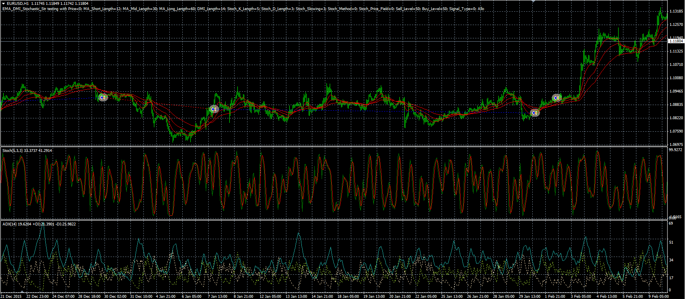

# EMA DMI Stochastic strategy

> Source: https://fxcodebase.com/code/viewtopic.php?f=38&t=63582  
> Forum: 38 · Topic 63582 · 1 post(s)

---

## EMA DMI Stochastic strategy

**Alexander.Gettinger** · Thu Jun 09, 2016 4:59 pm

The strategy based on the several indicators: Moving average, DMI, Stochastic.

Buy condition: MA1>MA2, MA2>MA3, DMI(+)>DMI(-), Stoch K<Buy level, Stoch K crosses above Stoch D.
Sell condition: MA1<MA2, MA2<MA3, DMI(+)<DMI(-), Stoch K>Sell level, Stoch K crosses under Stoch D.
MA1 - EMA with [MA_Short_Length] number of periods for [Price],
MA2 - EMA with [MA_Mid_Length] number of periods for [Price],
MA3 - EMA with [MA_Long_Length] number of periods for [Price].

 

Download:

 [EMA_DMI_Stochastic_Str.mq4](files/106700/EMA_DMI_Stochastic_Str.mq4)
