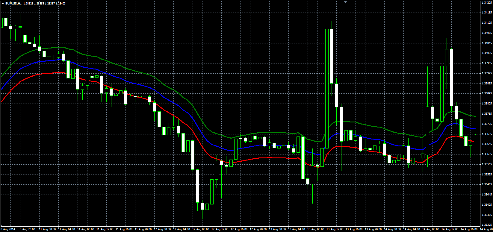

# EMA Offset Bands

> Source: https://fxcodebase.com/code/viewtopic.php?f=38&t=61214  
> Forum: 38 · Topic 61214 · 2 post(s)

---

## EMA Offset Bands

**Alexander.Gettinger** · Mon Sep 22, 2014 9:41 am

Original LUA indicator: [viewtopic.php?f=17&t=710](https://fxcodebase.com/code/viewtopic.php?f=17&t=710).

 

Method: 0 - Pips, 1 - Percentage;

Download:

 [EMA_Offset_Bands.mq4](files/96072/EMA_Offset_Bands.mq4)

---

## Re: EMA Offset Bands

**Apprentice** · Fri May 06, 2016 3:46 am

Bugs fixed.
Additional moving averages options added.
