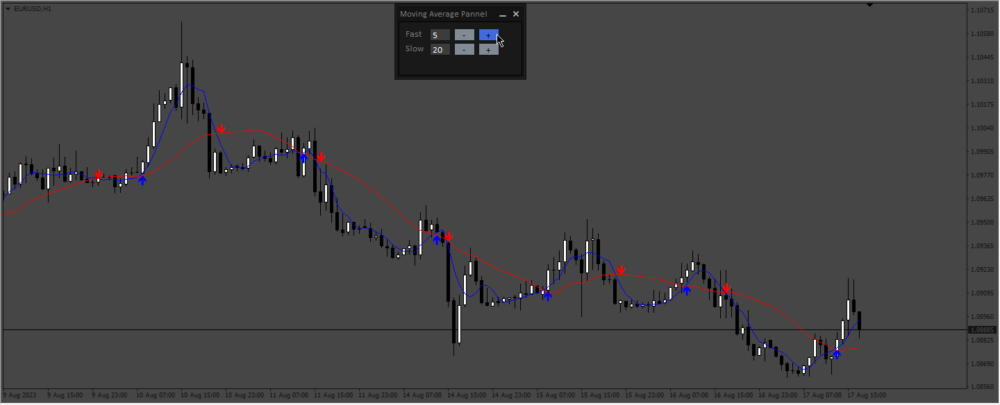

# Ema_Pannel

> Source: https://fxcodebase.com/code/viewtopic.php?f=38&t=74053  
> Forum: 38 · Topic 74053 · 4 post(s)

---

## Ema_Pannel

**Apprentice** · Fri Aug 18, 2023 12:34 pm

Based on the request.
[https://fxcodebase.com/code/viewtopic.p ... 89#p151989](https://fxcodebase.com/code/viewtopic.php?f=27&p=151989#p151989)

 [Ema_Pannel.mq4](files/152138/Ema_Pannel.mq4)

---

## Re: Ema_Pannel

**trader77** · Sun Nov 03, 2024 1:12 am

the code provided calculates simple moving average not exponential, I request this useful tool to be available in EMA and SMMA or other types of MAs. Thank yuo

---

## Re: Ema_Pannel

**Apprentice** · Wed Nov 06, 2024 3:04 pm

We have added your request to the development list.
Development reference 842

---

## Re: Ema_Pannel

**Apprentice** · Sun Nov 10, 2024 3:20 pm

 [Ema_Pannel_v2.0.mq4](files/157231/Ema_Pannel_v2.0.mq4)
