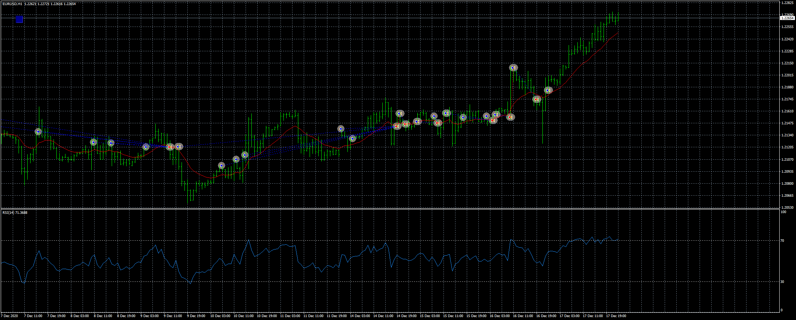

# EMA RSI Jozelu06 EA

> Source: https://fxcodebase.com/code/viewtopic.php?f=38&t=71042  
> Forum: 38 · Topic 71042 · 4 post(s)

---

## EMA RSI Jozelu06 EA

**Apprentice** · Wed Mar 24, 2021 3:08 pm

Based on the request.
[viewtopic.php?f=27&p=141294](https://fxcodebase.com/code/viewtopic.php?f=27&p=141294)

 [EMA RSI Jozelu06 EA.mq4](files/141323/EMA%20RSI%20Jozelu06%20EA.mq4)

---

## Re: EMA RSI Jozelu06 EA

**Jozelu06** · Thu Mar 25, 2021 12:03 pm

Hello, it still does not work correctly, you have closed a purchase when the rsi has crossed below the 50 value, but they do not have to close there, and just when closing it has created a sale, but the price was still above the EMA, and You would only have to create a buy operation if the RSI rose again to the value 50, or if the price already closed below the EMA

---

## Re: EMA RSI Jozelu06 EA

**Apprentice** · Fri Mar 26, 2021 4:03 am

Your request is added to the development list.
Development reference 317.

---

## Re: EMA RSI Jozelu06 EA

**Apprentice** · Tue Apr 06, 2021 12:32 pm

Disable "Close on opposite"
