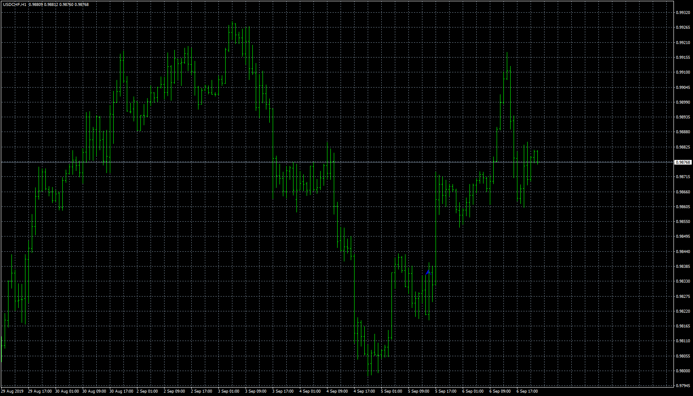
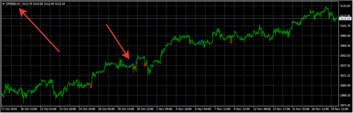

# EMA_RSI_STO_Signal

> Source: https://fxcodebase.com/code/viewtopic.php?f=38&t=69128  
> Forum: 38 · Topic 69128 · 4 post(s)

---

## EMA_RSI_STO_Signal

**Apprentice** · Thu Nov 14, 2019 11:30 am

Based on request/ TS2 version.
[viewtopic.php?f=29&t=892&start=10](https://fxcodebase.com/code/viewtopic.php?f=29&t=892&start=10)

Buy
EMA5>EMA10
RSI >50
RSI <70
K%>D%
K%< 80

Sell
EMA5>EMA10
RSI <50
RSI >30
K%<D%
K%> 20

 [EMA_RSI_STO_Signal.mq4](files/129771/EMA_RSI_STO_Signal.mq4)

---

## Re: EMA_RSI_STO_Signal

**mipro66** · Mon Nov 18, 2019 11:32 am

hello, it´s a fine indy, but it´s always work on currencies , not on indices.

Please if it´s possible correct it.

Thank you very much in advanced.

---

## Re: EMA_RSI_STO_Signal

**Apprentice** · Tue Nov 19, 2019 6:46 am

Your request is added to the development list.
Development reference 330.

---

## Re: EMA_RSI_STO_Signal

**Apprentice** · Wed Nov 20, 2019 5:56 am

I don't see any issues on indexes. I used SPX500 for the test.
