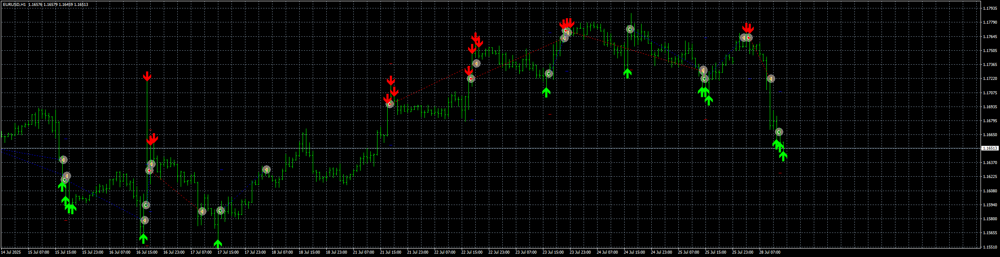

# EMABB_EA

> Source: https://fxcodebase.com/code/viewtopic.php?f=38&t=76195  
> Forum: 38 · Topic 76195 · 1 post(s)

---

## EMABB_EA

**Apprentice** · Mon Jul 28, 2025 6:16 am

Based on the request.
[https://fxcodebase.com/code/viewtopic.p ... 94#p159994](https://fxcodebase.com/code/viewtopic.php?f=17&p=159994#p159994)
"Close position at opposite signal" option is available
"Entry logic" option added with "Direct" or "Reverse" option
with "SL by" option the "Money (depends on fixed or margin determined lots)" option is available

 [emabb_arrow.mq4](files/160064/emabb_arrow.mq4)

 [EMABB_EA_v1.10.mq4](files/160064/EMABB_EA_v1.10.mq4)
