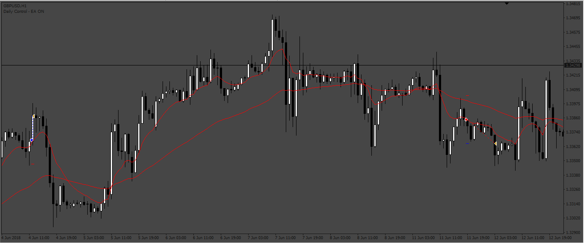
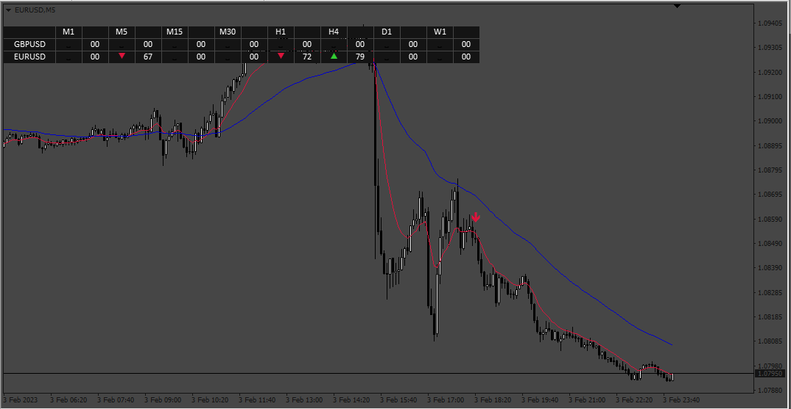

# EmasCandlesEA

> Source: https://fxcodebase.com/code/viewtopic.php?f=38&t=72850  
> Forum: 38 · Topic 72850 · 4 post(s)

---

## EmasCandlesEA

**Apprentice** · Tue Oct 18, 2022 1:38 am

Based on the request.
[https://fxcodebase.com/code/viewtopic.php?f=27&p=147884](https://fxcodebase.com/code/viewtopic.php?f=27&p=147884)

 [EmasCandlesEA.mq4](files/147943/EmasCandlesEA.mq4)

 

 [Emas Candles Dashboard.mq4](files/147943/Emas%20Candles%20Dashboard.mq4)

---

## Re: EmasCandlesEA

**TheYoda** · Tue Oct 18, 2022 7:02 am

Okay, thank you. I will try it out and keep you posted.

---

## Re: EmasCandlesEA

**TheYoda** · Tue Oct 18, 2022 7:22 am

I'm sorry, this is EA that was created. I actually asked for dashboard and not EA robot.
Can you please help with the dashboard instead ?

---

## Re: EmasCandlesEA

**TheYoda** · Tue Oct 18, 2022 7:34 am

The marked arrow on the chart you posted is also entry point.
Fingers crossed on the creation dashboard, as that's the request that i posted.
Thanks for all the good work.
