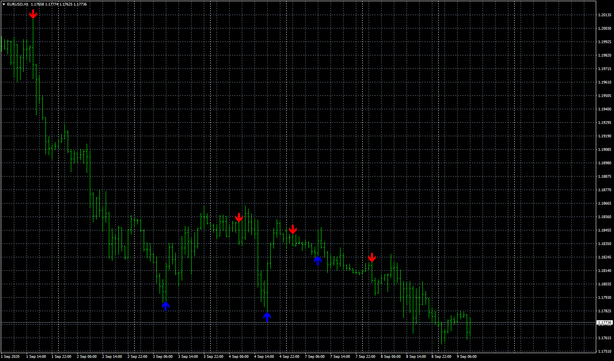
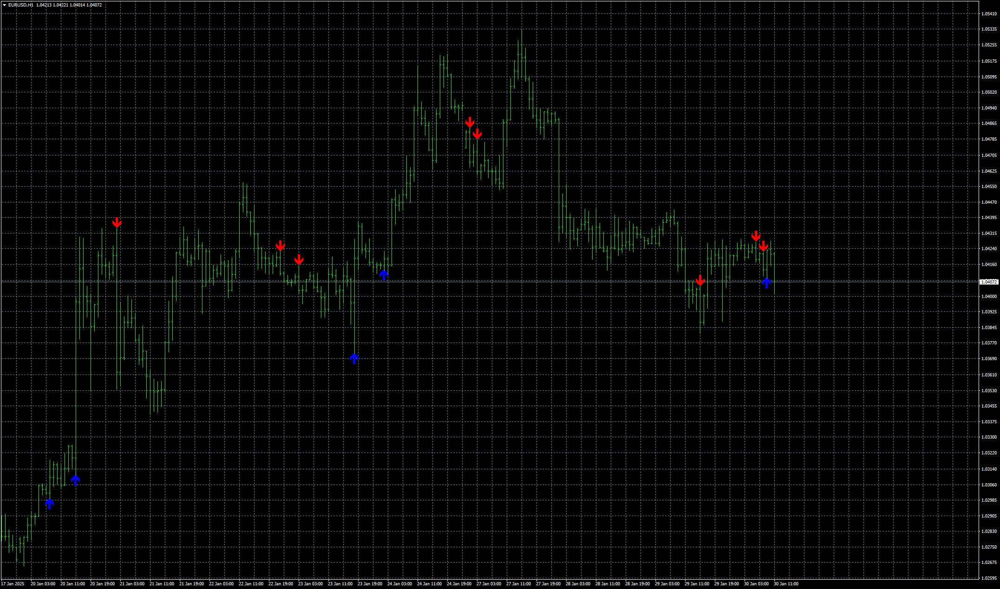

# Englufing

> Source: https://fxcodebase.com/code/viewtopic.php?f=38&t=70407  
> Forum: 38 · Topic 70407 · 6 post(s)

---

## Englufing

**Apprentice** · Wed Sep 09, 2020 2:33 am

Based on request.
[viewtopic.php?f=27&t=70374](https://fxcodebase.com/code/viewtopic.php?f=27&t=70374)

 [Englufing.mq4](files/137458/Englufing.mq4)

 [Englufing Dashboard.mq4](files/137458/Englufing%20Dashboard.mq4)

 [Englufing.mq5](files/137458/Englufing.mq5)

 [Englufing Dashboard.mq5](files/137458/Englufing%20Dashboard.mq5)

---

## Re: Englufing

**Bastos1983** · Fri Sep 18, 2020 12:56 pm

sa ne fonctionne pas .

---

## Re: Englufing

**Bastos1983** · Wed Apr 13, 2022 2:13 pm

bonjour l indicateur efface les objets dessiner des que l on change d uniter de temps .possible de modifier please

hello the indicator erases the objects drawn as soon as we change the unit of time. possible to modify please

---

## Re: Englufing

**Apprentice** · Thu Apr 14, 2022 6:45 am

Your request is added to the development list.
Development reference 236.

---

## Re: Englufing

**Apprentice** · Thu Jan 23, 2025 4:39 pm

[Englufing.mq4](files/157986/Englufing.mq4)

 [Englufing.mq5](files/157986/Englufing.mq5)

Try this versions.

---

## Re: Englufing

**Apprentice** · Thu Jan 30, 2025 4:52 am

 [Engulfing.mq4](files/158057/Engulfing.mq4)
