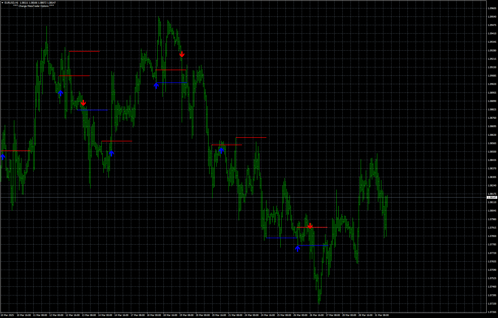
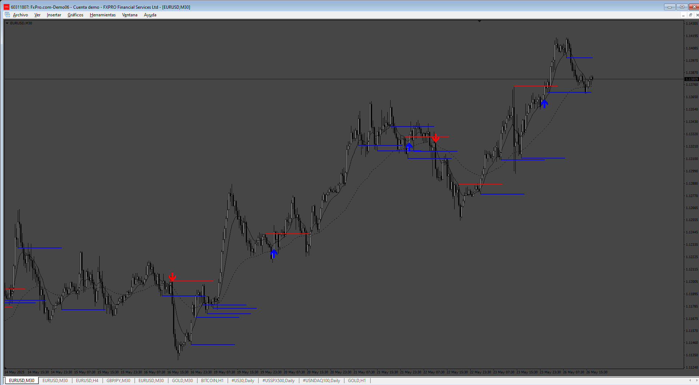
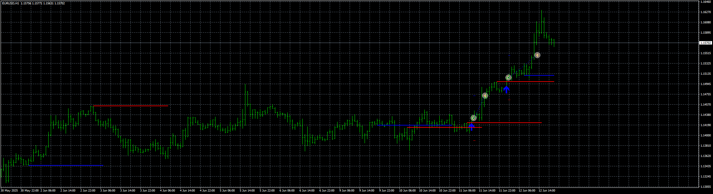

# EnglufingBreak

> Source: https://fxcodebase.com/code/viewtopic.php?f=38&t=75781  
> Forum: 38 · Topic 75781 · 7 post(s)

---

## EnglufingBreak

**Apprentice** · Mon Mar 31, 2025 12:56 pm

 [EnglufingBreak.mq4](files/158843/EnglufingBreak.mq4)

---

## Re: EnglufingBreak

**fsmith** · Wed May 21, 2025 7:39 am

Okay, thanks. Can you add an EMA filter? If a fast EMA is above a slow one, it only sends buy signals. The reverse is true for sell signals.

---

## Re: EnglufingBreak

**Apprentice** · Sat May 24, 2025 2:47 pm

We have added your request to the development list.
Development reference 353

---

## Re: EnglufingBreak

**Apprentice** · Thu May 29, 2025 11:26 am

 [EnglufingBreak_filter.mq4](files/159399/EnglufingBreak_filter.mq4)

---

## Re: EnglufingBreak

**fsmith** · Fri Jun 13, 2025 10:07 am

Great Sr! good signals.
Could you make the EA based on this signals please,

thanks

---

## Re: EnglufingBreak

**Apprentice** · Wed Jun 18, 2025 11:29 am

We have added your request to the development list.
Development reference 395

---

## Re: EnglufingBreak

**Apprentice** · Fri Jun 20, 2025 2:03 am

 [EnglufingBreak_filter_EA_v1.00.mq4](files/159632/EnglufingBreak_filter_EA_v1.00.mq4)
