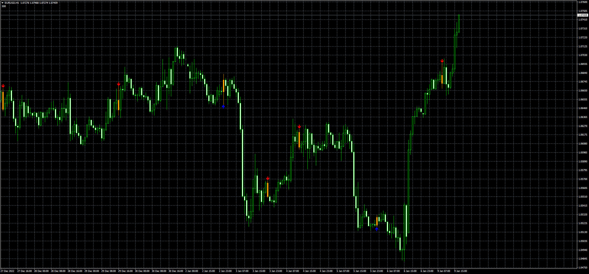

# Engulfing_Look-back_Alert

> Source: https://fxcodebase.com/code/viewtopic.php?f=38&t=73155  
> Forum: 38 · Topic 73155 · 8 post(s)

---

## Engulfing_Look-back_Alert

**Apprentice** · Mon Jan 09, 2023 10:33 am

Based on the request.
[https://fxcodebase.com/code/viewtopic.php?f=27&p=148827](https://fxcodebase.com/code/viewtopic.php?f=27&p=148827)

 [Engulfing_Look-back_Alert.mq4](files/148986/Engulfing_Look-back_Alert.mq4)

---

## Re: Engulfing_Look-back_Alert

**krazii** · Wed Jan 11, 2023 4:57 pm

Thanks for this however there are issues as this does not fully match the Tradingview version. Can you please compare the two to review the differences?

In addition, the candle bodies do not fill with the selected colour (only the candle borders).

---

## Re: Engulfing_Look-back_Alert

**Apprentice** · Thu Jan 12, 2023 4:28 am

We have added your request to the development list.
Development reference 32.

---

## Re: Engulfing_Look-back_Alert

**Apprentice** · Thu Jan 12, 2023 6:03 am

The indicator of the MT4 and the TradingView do not always match perfectly.
Can You explain what is the difference or function that you need?
The indicator fill the candle bodies as You can see in the screenshot

---

## Re: Engulfing_Look-back_Alert

**krazii** · Mon Dec 18, 2023 4:39 pm

Hi **Apprentice** , I discovered an issue with this which is that if the candle engulfed is the same (i.e. bullish candle engulfs prior bullish candle), it does not show as engulfing currently... Please note, any candle, regardless of whether bullish or bearish (that is engulfed) should be included.

Could you please fix this issue?

Thanks in advance!

---

## Re: Engulfing_Look-back_Alert

**krazii** · Thu Jan 25, 2024 3:14 pm

Following-up.... Thx

---

## Re: Engulfing_Look-back_Alert

**pang19** · Tue Mar 19, 2024 10:03 am

Perfect!!

Thank you

Apprentice & PO

---

## Re: Engulfing_Look-back_Alert

**krazii** · Wed Mar 20, 2024 4:37 pm

I don't think the issue (see my last comment) has been resolved yet.
