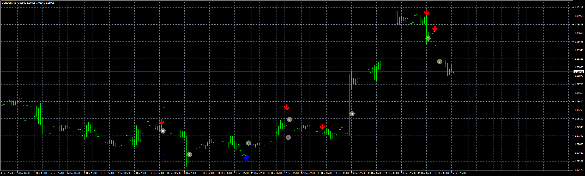
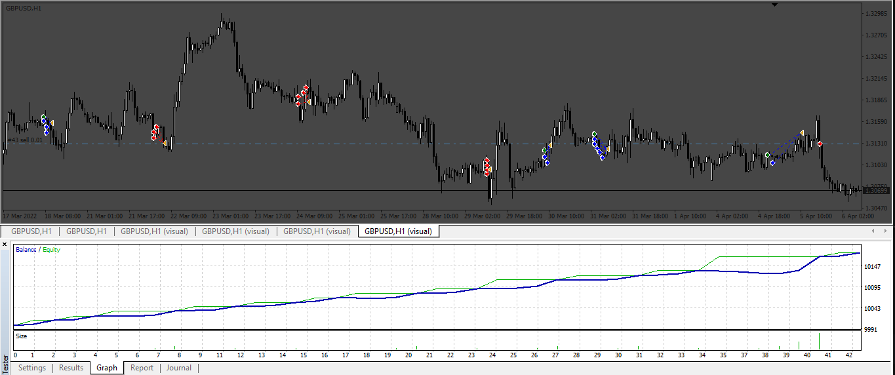
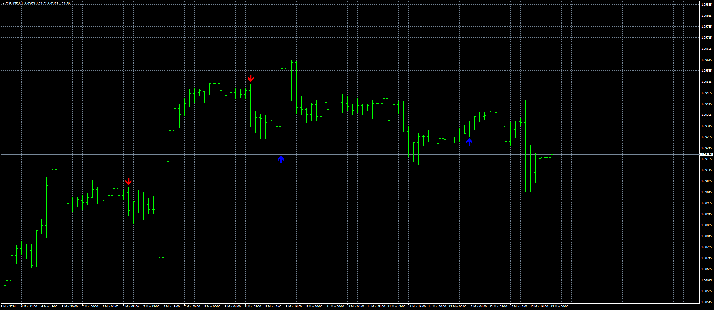

# EngulfingMA_EA

> Source: https://fxcodebase.com/code/viewtopic.php?f=38&t=74543  
> Forum: 38 · Topic 74543 · 6 post(s)

---

## EngulfingMA_EA

**Apprentice** · Wed Jan 17, 2024 12:01 pm

Based on the request.
[https://fxcodebase.com/code/viewtopic.php?f=17&t=74497](https://fxcodebase.com/code/viewtopic.php?f=17&t=74497)

 [EngulfingMA.mq4](files/154089/EngulfingMA.mq4)

 [EngulfingMA_EA_v1.00.mq4](files/154089/EngulfingMA_EA_v1.00.mq4)

---

## Re: EngulfingMA_EA

**gomezM** · Wed Feb 28, 2024 8:48 am

> **Apprentice wrote:**
>
>
> eurusd-h1-fxcm-australia-pty.png
>
>
> Based on the request.
> [https://fxcodebase.com/code/viewtopic.php?f=17&t=74497](https://fxcodebase.com/code/viewtopic.php?f=17&t=74497)
>
>
> EngulfingMA.mq4
>
>
>
>
> EngulfingMA_EA_v1.00.mq4

Thanks a lot,
could you please add a recovery grid system?

---

## Re: EngulfingMA_EA

**Apprentice** · Thu Feb 29, 2024 5:13 am

We have added your request to the development list.
Development reference 189

---

## Re: EngulfingMA_EA

**Apprentice** · Sun Mar 03, 2024 7:19 am

 [EngulfingMA_EA_v2.00.mq4](files/154568/EngulfingMA_EA_v2.00.mq4)

---

## Re: EngulfingMA_EA

**gomezM** · Thu Mar 07, 2024 1:25 pm

> **Apprentice wrote:**
>
>
> eurusd-h1-fxcm-australia-pty.png
>
>
> Based on the request.
> [https://fxcodebase.com/code/viewtopic.php?f=17&t=74497](https://fxcodebase.com/code/viewtopic.php?f=17&t=74497)
>
>
> EngulfingMA.mq4
>
>
>
>
> EngulfingMA_EA_v1.00.mq4

Hi, could you set the typical alerts from the indicator? popup, mail, phone.
thanks

---

## Re: EngulfingMA_EA

**Apprentice** · Tue Mar 12, 2024 12:25 pm

 [EngulfingMA_v2.00.mq4](files/154660/EngulfingMA_v2.00.mq4)
