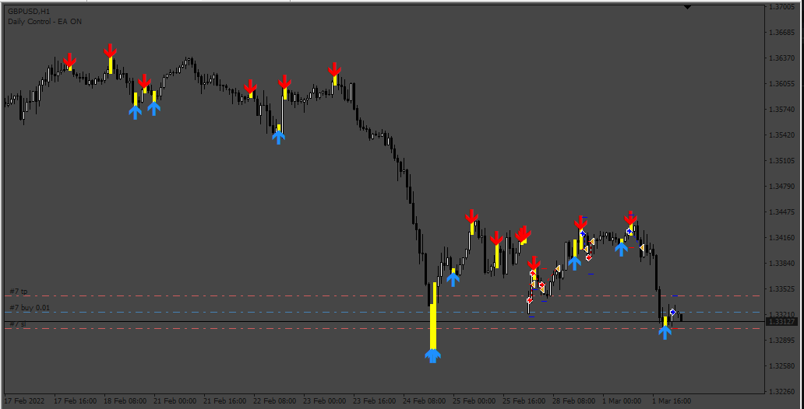

# Enigma_Arrows_EA

> Source: https://fxcodebase.com/code/viewtopic.php?f=38&t=74665  
> Forum: 38 · Topic 74665 · 3 post(s)

---

## Enigma_Arrows_EA

**Apprentice** · Sun Mar 03, 2024 7:48 am

Based on the request.
[https://fxcodebase.com/code/viewtopic.php?f=38&t=74572](https://fxcodebase.com/code/viewtopic.php?f=38&t=74572)

 [Enigma_Scalper_Arrows.mq4](files/154576/Enigma_Scalper_Arrows.mq4)

 [Enigma_Arrows_EA.mq4](files/154576/Enigma_Arrows_EA.mq4)

---

## Re: Enigma_Arrows_EA

**rickCreations** · Sun Mar 03, 2024 9:29 am

Code: [Select all](https://fxcodebase.com/code/)
`2024.03.03 22:28:13.939   2023.03.24 11:00:00  Scalper_EA EURUSD.TS,H1: SendNewOrder::doAction Connot Send Order, error: 4107
2024.03.03 22:28:13.939   2023.03.24 11:00:00  Scalper_EA EURUSD.TS,H1: OrderSend error 4107
2024.03.03 22:28:13.939   2023.03.24 11:00:00  Scalper_EA EURUSD.TS,H1: invalid takeprofit for OrderSend function
2024.03.03 22:28:13.939   2023.03.24 11:00:00  Scalper_Arrows EURUSD.TS,H1: Alert: ScalperSignal :: EURUSD.TS :: H1 > Signal SELL
2024.03.03 22:28:13.922   2023.03.24 09:00:00  Scalper_EA EURUSD.TS,H1: SendNewOrder::doAction Connot Send Order, error: 4107
2024.03.03 22:28:13.922   2023.03.24 09:00:00  Scalper_EA EURUSD.TS,H1: OrderSend error 4107
2024.03.03 22:28:13.922   2023.03.24 09:00:00  Scalper_EA EURUSD.TS,H1: invalid stoploss for OrderSend function`

Error 4107

---

## Re: Enigma_Arrows_EA

**inver61** · Mon Mar 04, 2024 7:20 pm

Hello, thank you very much, perfect work.
