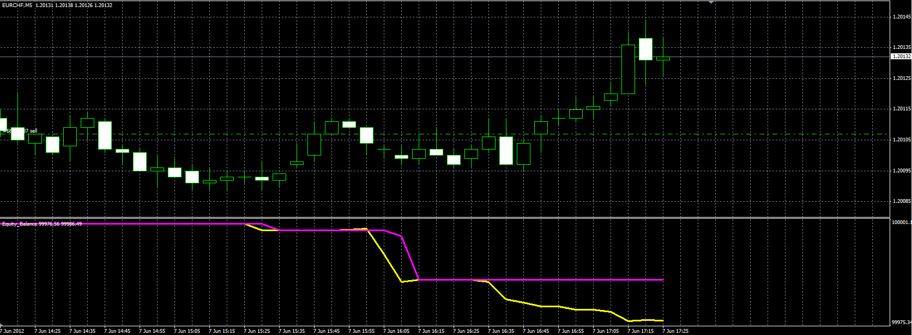
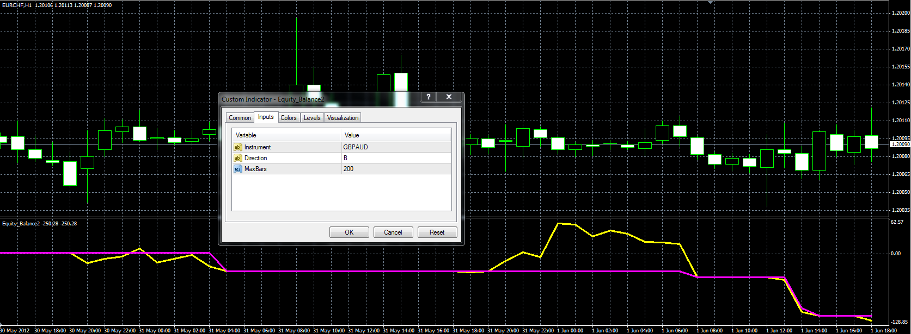

# Equity&Balance indicator

> Source: https://fxcodebase.com/code/viewtopic.php?f=38&t=20055  
> Forum: 38 · Topic 20055 · 8 post(s)

---

## Equity&Balance indicator

**Alexander.Gettinger** · Thu Jun 07, 2012 2:08 pm

The indicator shows the charts of equity and balance.
The indicator uses the depth of the history as in the account history.

 

Download:

 [Equity_Balance.mq4](files/35275/Equity_Balance.mq4)

---

## Re: Equity&Balance indicator

**Alexander.Gettinger** · Thu Jun 07, 2012 2:39 pm

The indicator shows the change in the balance and equity with the ability to specify instrument and direction of the orders.
The direction can have the values "B" and "S".

 

Download:

 [Equity_Balance2.mq4](files/35276/Equity_Balance2.mq4)

---

## Re: Equity&Balance indicator

**bfleming** · Wed Sep 26, 2012 4:10 am

Would it be possible to get this indicator as a .lua file? Thanks!!

---

## Re: Equity&Balance indicator

**Apprentice** · Wed Sep 26, 2012 4:21 am

Try this two indicators.
[viewtopic.php?f=17&t=2851&p=6510&hilit=Equity#p6510](https://fxcodebase.com/code/viewtopic.php?f=17&t=2851&p=6510&hilit=Equity#p6510)
[viewtopic.php?f=17&t=9755&p=21306&hilit=Equity#p21306](https://fxcodebase.com/code/viewtopic.php?f=17&t=9755&p=21306&hilit=Equity#p21306)

---

## Re: Equity&Balance indicator

**bfleming** · Wed Sep 26, 2012 7:46 am

The balance indicator is close, but what I'm looking for is both a balance and equity graph.

---

## Re: Equity&Balance indicator

**bfleming** · Wed Sep 26, 2012 7:50 am

And when I tried to load the Balance indicator I got the attached message. I noticed that the account # in the indicator didn't reflect my actual account #, but I wasn't able to change it.

Thanks.

---

## Re: Equity&Balance indicator

**Apprentice** · Thu Sep 27, 2012 2:09 am

Have you installed This Lua library, as requested.
[viewtopic.php?f=28&t=9753](https://fxcodebase.com/code/viewtopic.php?f=28&t=9753)
You need this to be able to use this indicator.

---

## Re: Equity&Balance indicator

**bfleming** · Thu Sep 27, 2012 2:34 am

I hadn't installed the Lua Library, so now the balance indicator works, thanks. But what about an equity indicator? The one you linked to doesn't show an equity graph, which is what I'm looking for. That is, an equity graph overlayed on the balance graph, like with the .mq4 indicator above, but .lua. Thanks!
