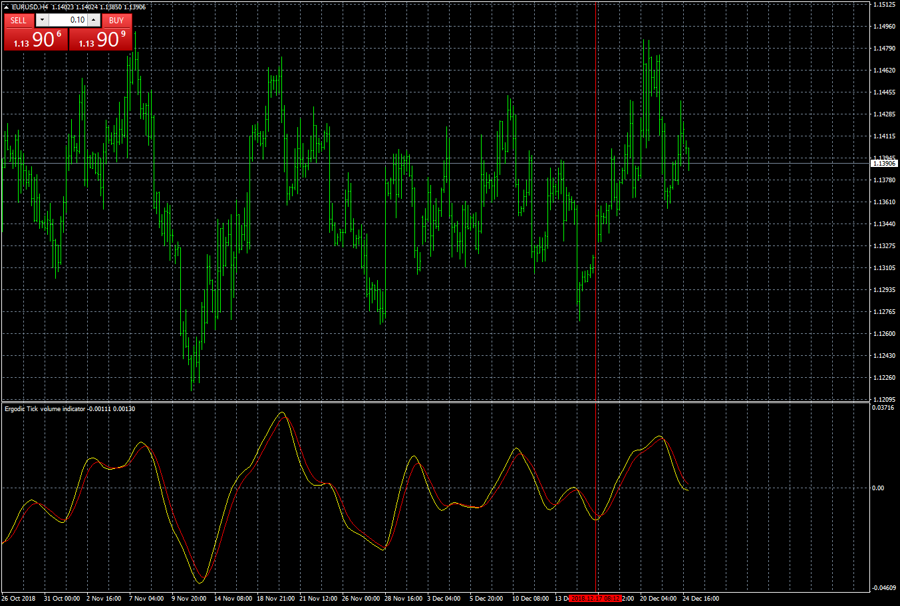

# Ergodic_TVI

> Source: https://fxcodebase.com/code/viewtopic.php?f=38&t=67206  
> Forum: 38 · Topic 67206 · 8 post(s)

---

## Ergodic_TVI

**Apprentice** · Wed Dec 26, 2018 5:53 am

Based on request.
[viewtopic.php?f=48&t=65995](https://fxcodebase.com/code/viewtopic.php?f=48&t=65995)

 [Ergodic_TVI.mq4](files/123045/Ergodic_TVI.mq4)

 [Ergodic_TVI MS MTF.mq4](files/123045/Ergodic_TVI%20MS%20MTF.mq4)

---

## Re: Ergodic_TVI

**logicgate** · Wed Dec 26, 2018 7:03 am

Seeing some tasty signals in there already!!

God Bless and Good Trades dear friend!

---

## Re: Ergodic_TVI

**alienfriend18** · Fri Jun 26, 2020 2:15 pm

Please add multi symbol and mtf options. Thanks

---

## Re: Ergodic_TVI

**Apprentice** · Sun Jun 28, 2020 4:32 am

Your request is added to the development list.
Development reference 1568.

---

## Re: Ergodic_TVI

**Apprentice** · Wed Jul 01, 2020 5:25 am

Ergodic_TVI MS MTF added.

---

## Re: Ergodic_TVI

**logicgate** · Sun Jul 31, 2022 12:02 pm

Can we get a MT5 version of the MTF MS version?

---

## Re: Ergodic_TVI

**Apprentice** · Tue Aug 02, 2022 4:53 am

We have added your request to the development list.
Development reference 457.

---

## Re: Ergodic_TVI

**logicgate** · Fri Nov 22, 2024 5:27 am

Can we get a deliver on the MT5 version of this, please?
