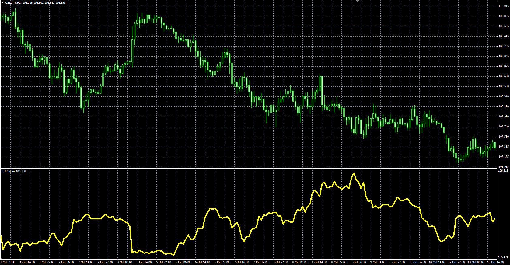
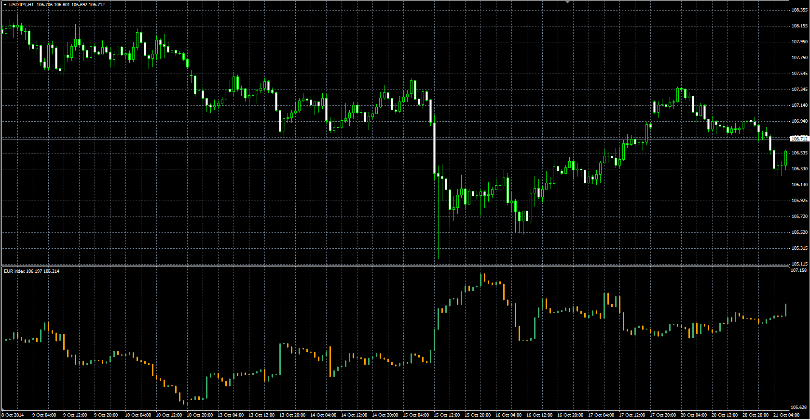

# Euro Index (EURX)

> Source: https://fxcodebase.com/code/viewtopic.php?f=38&t=61372  
> Forum: 38 · Topic 61372 · 1 post(s)

---

## Euro Index (EURX)

**Alexander.Gettinger** · Thu Oct 23, 2014 10:04 am

Formula:
EURX = (EURUSD)^0.3155*(EURGBP)^0.3056*(EURJPY)^0.1891*(EURSEK)^0.0785*(EURCHF)^0.1113.

To use the indicator, you need to be subscribed to the instruments: EURUSD, EURGBP, EURJPY, EURSEK, EURCHF.

 

Download:

 [EURX.mq4](files/96710/EURX.mq4)

**Candle version:**

 

Download:

 [EURX_Candle.mq4](files/96710/EURX_Candle.mq4)
