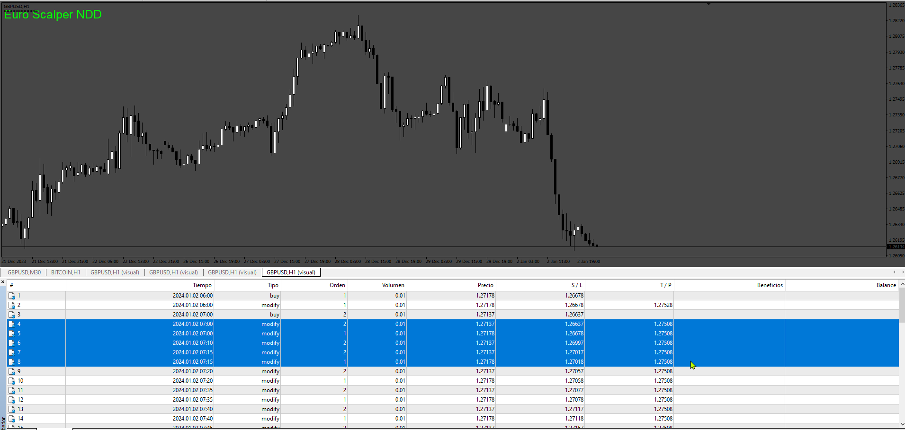
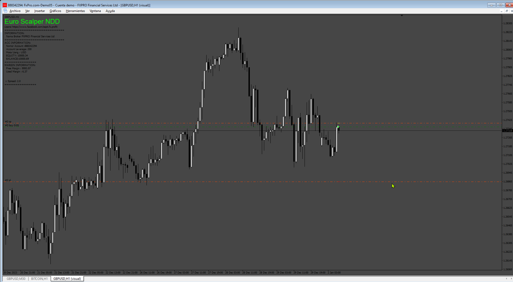
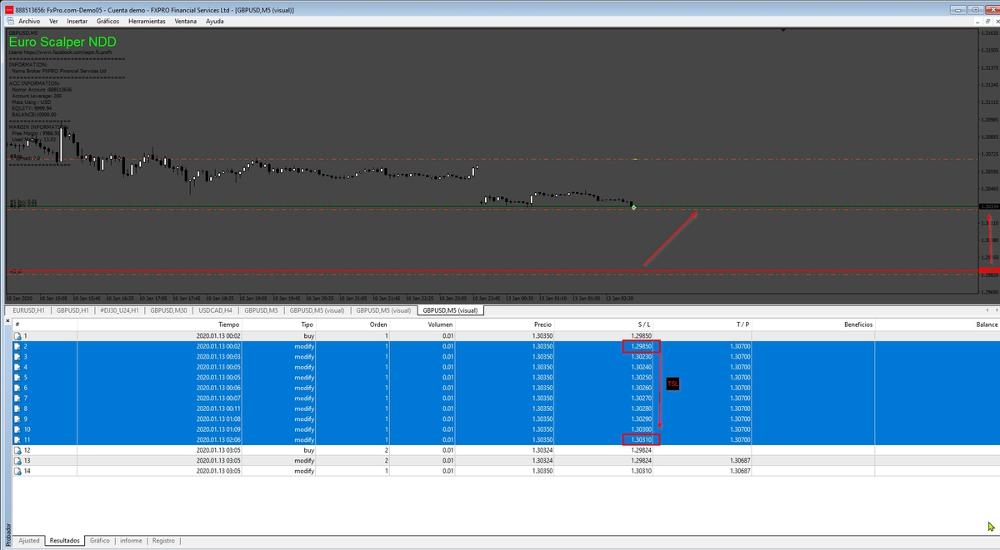
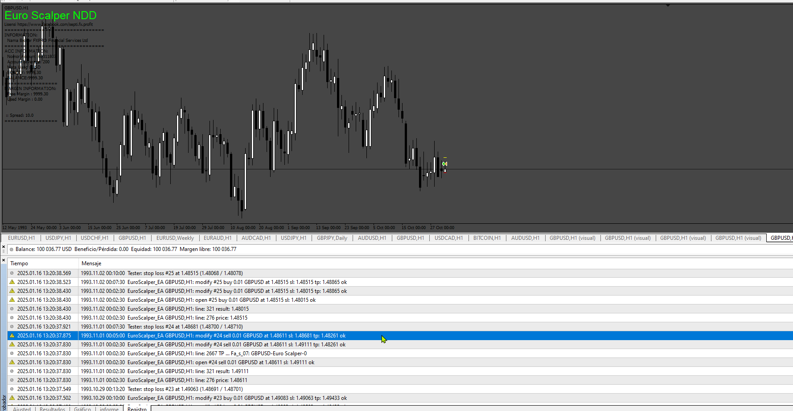
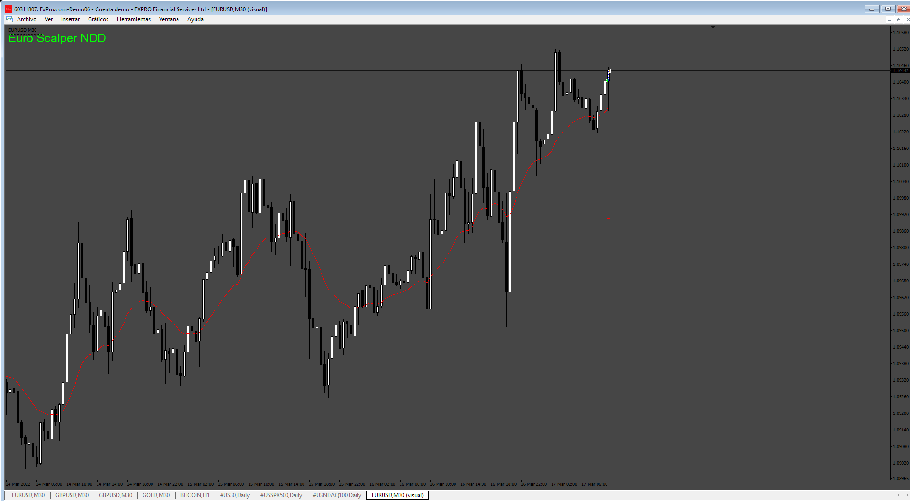
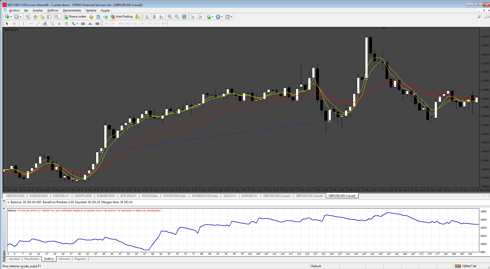

# EuroScalper_EA

> Source: https://fxcodebase.com/code/viewtopic.php?f=38&t=74984  
> Forum: 38 · Topic 74984 · 20 post(s)

---

## EuroScalper_EA

**Apprentice** · Tue Jun 18, 2024 2:11 pm

 

Based on the request.
[https://fxcodebase.com/code/viewtopic.php?f=38&t=74963](https://fxcodebase.com/code/viewtopic.php?f=38&t=74963)

 [EuroScalper_EA.mq4](files/155812/EuroScalper_EA.mq4)

---

## Re: EuroScalper_EA

**myhome13** · Mon Jun 24, 2024 10:55 pm

Thank you for EA
In this EA TSL not working, all other function working very well.
pls resolve the issue.

---

## Re: EuroScalper_EA

**Apprentice** · Tue Jul 02, 2024 3:42 pm

We have added your request to the development list.
Development reference 541

---

## Re: EuroScalper_EA

**Apprentice** · Fri Aug 16, 2024 5:43 pm

 [EuroScalper_EA.mq4](files/156454/EuroScalper_EA.mq4)

---

## Re: EuroScalper_EA

**murilovagner** · Tue Jan 07, 2025 7:15 pm

I'm carrying out some tests and realized that the code only makes buy orders. Can you configure it to place sell orders?

---

## Re: EuroScalper_EA

**Apprentice** · Sun Jan 12, 2025 12:50 pm

We have added your request to the development list.
Development reference 30

---

## Re: EuroScalper_EA

**Apprentice** · Mon Jan 20, 2025 4:13 pm

 [EuroScalper_EA.mq4](files/157921/EuroScalper_EA.mq4)

---

## Re: EuroScalper_EA

**[email protected]** · Thu Apr 17, 2025 1:42 am

> **Apprentice wrote:**
>
>
> 30.png
>
>
>
>
> EuroScalper_EA.mq4

Hi- thanks for your great work.

I want some changes in this EA.
Please use a MA filter for the EA(true/False).
Please make changes in the code that only one SL used for all open positions just like the TP in the original code.

thanks in advance

---

## Re: EuroScalper_EA

**Apprentice** · Sun Apr 20, 2025 4:40 am

We have added your request to the development list.
Development reference 272

---

## Re: EuroScalper_EA

**Apprentice** · Sat Apr 26, 2025 2:57 pm

 [EuroScalper_EA_MaFilter.mq4](files/159046/EuroScalper_EA_MaFilter.mq4)

---

## Re: EuroScalper_EA

**[email protected]** · Sat May 03, 2025 5:33 pm

> **Apprentice wrote:**
>
>
> 272.png
>
>
>
>
> EuroScalper_EA_MaFilter.mq4

Hi. Please make these changes in the EA.

1-Set just one SL for the Ea just like the TP. when SL was touched close all open positions. just like TP.
2-make an option that if SL touched then EA can not open new positions until "N" next candle. "N" will specified by trader in the input.
3- make a close position option that if price cross the moving average and "M" next candles do not touch the MA and prices remain on new side of MA, then close all open positions. "M" will specified by trader in the input.

thanks

---

## Re: EuroScalper_EA

**Apprentice** · Wed May 07, 2025 12:24 pm

We have added your request to the development list.
Development reference 308

---

## Re: EuroScalper_EA

**Apprentice** · Sat May 17, 2025 10:34 am

[EuroScalper_EA_MaFilter.mq4](files/159263/EuroScalper_EA_MaFilter.mq4)

Try this version.

---

## Re: EuroScalper_EA

**[email protected]** · Sun May 18, 2025 11:33 am

> **Apprentice wrote:**
>
>
> EuroScalper_EA_MaFilter.mq4
>
>
> Try this version.

Hi. thanks for your great job.

these two options about moving average was added to the input data but does not work and EA doesn't act as them . please check and fix it.

2-make an option that if SL touched then EA can not open new positions until "N" next candle. "N" will specified by trader in the input.
3- make a close position option that if price cross the moving average and "M" next candles do not touch the MA and prices remain on new side of MA, then close all open positions. "M" will specified by trader in the input.

Thanks in advance.

---

## Re: EuroScalper_EA

**[email protected]** · Sun May 18, 2025 12:46 pm

> **Apprentice wrote:**
>
>
> EuroScalper_EA_MaFilter.mq4
>
>
> Try this version.

MA filter and close options doesn't work. please fix them.

---

## Re: EuroScalper_EA

**Apprentice** · Mon May 19, 2025 2:41 pm

We have added your request to the development list.
Development reference 337

---

## Re: EuroScalper_EA

**Apprentice** · Wed May 21, 2025 1:20 pm

[EuroScalper_EA_MaFilter.mq4](files/159314/EuroScalper_EA_MaFilter.mq4)

Try this version.

---

## Re: EuroScalper_EA

**kenny22** · Sat May 24, 2025 4:50 am

> **Apprentice wrote:**
>
>
> The attachment **484_tsl.png** is no longer available
>
>
>
>
> The attachment **484_tsl.png** is no longer available
>
>
> Based on the request.
> [https://fxcodebase.com/code/viewtopic.php?f=38&t=74963](https://fxcodebase.com/code/viewtopic.php?f=38&t=74963)
>
>
> The attachment **484_tsl.png** is no longer available

Sir, please change the order opening method of this EA to Sidus method strategy, and add the function of closing positions by reverse signal. Thanks.
The Sidus Method.pdf [https://fxcodebase.com/code/viewtopic.p ... kan+Profit](https://fxcodebase.com/code/viewtopic.php?f=38&t=72681&hilit=Vulkan+Profit)

---

## Re: EuroScalper_EA

**Apprentice** · Sat May 24, 2025 2:31 pm

We have added your request to the development list.
Development reference 341

---

## Re: EuroScalper_EA

**Apprentice** · Sat Jun 07, 2025 9:04 am

 [SIDUS_EA.mq4](files/159531/SIDUS_EA.mq4)
