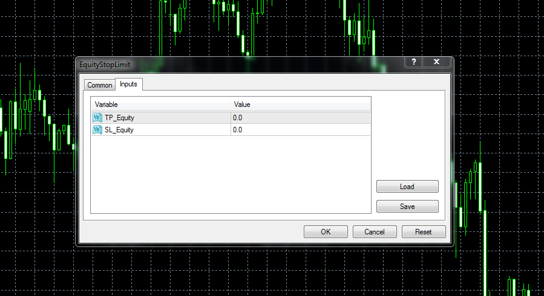

# Expert advisor for equity management

> Source: https://fxcodebase.com/code/viewtopic.php?f=38&t=19093  
> Forum: 38 · Topic 19093 · 5 post(s)

---

## Expert advisor for equity management

**Alexander.Gettinger** · Thu May 24, 2012 1:30 pm

Expert advisor closes all orders when the equity reach specified the maximum or minimum values.

 

Download:

 [EquityStopLimit.mq4](files/34002/EquityStopLimit.mq4)

---

## Re: Expert advisor for equity management

**Vantages** · Wed Jun 25, 2014 5:32 am

Hi Alexander,

Anything like this equity management in TS2 (lua) ?
In percentile maybe added and a magic number would be
necessary to avoid interference with other strategy.

Thanks.

Vantages

---

## Re: Expert advisor for equity management

**Apprentice** · Thu Jun 26, 2014 2:50 am

U can use this strategy written by Alex.
[viewtopic.php?f=31&t=2901&hilit=profit](https://fxcodebase.com/code/viewtopic.php?f=31&t=2901&hilit=profit)

---

## Re: Expert advisor for equity management

**Vantages** · Thu Jun 26, 2014 6:50 am

Hello Apprentice,

Thank you for your response. All your work in here, real brilliance of you!

I tried that but there are errors :
16:attempt to index field 'host'(a nil value)
2:attempt to index global 'strategy'(a nil value)

Right now I'm using your BREAKEVEN STRATEGY that's revised by MooMooFx,
just having a little confusion with the way it locks & trails the profit. At the same time,
I'm also using your BREAKEVEN PRICE STRATEGY. All are fantastic!

However, may I ask for a little modification like:
>>>MOVING STOPS TO BREAKEVEN>>>TRAILINGPROFITS>>>CLOSINGATPROFITS(when market price retraces to breakeven price of all positions,closing of positions with positives only & leaving the negatives)>>>CLOSINGALLATPROFITS(closing all positions at certain total profits).

The intention is to accumulate a lot of positions (hundreds and thousands) at multiple levels, with this modifications, I think protection and profitability are combined.

Thank you very much for your time. Have a nice day.

Vantages

---

## Re: Expert advisor for equity management

**Apprentice** · Fri Jun 27, 2014 3:54 am

I have informed Alex about Bug.
Also, i have added your request in the development list.
