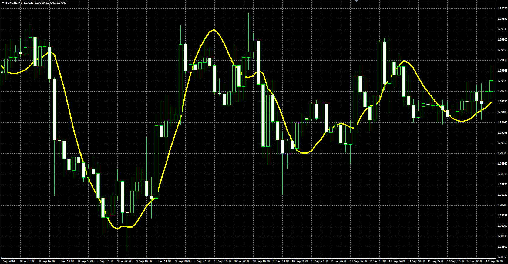

# Exponential Smoothing with Trend Adjustment

> Source: https://fxcodebase.com/code/viewtopic.php?f=38&t=61387  
> Forum: 38 · Topic 61387 · 1 post(s)

---

## Exponential Smoothing with Trend Adjustment

**Alexander.Gettinger** · Mon Oct 27, 2014 10:56 am

Original LUA indicator: [viewtopic.php?f=17&t=23831](https://fxcodebase.com/code/viewtopic.php?f=17&t=23831).

Formulas:
EMATA[i] = Alpha*Price[i-1]+(1-Alpha)*(EMATA[i-1]+Trend[i-1]),
Trend[i] = Beta*(EMATA[i]-EMATA[i-1])+(1-Beta)*Trend[i-1].

 

Download:

 [EMA_With_Trend_Adjustment.mq4](files/96763/EMA_With_Trend_Adjustment.mq4)
