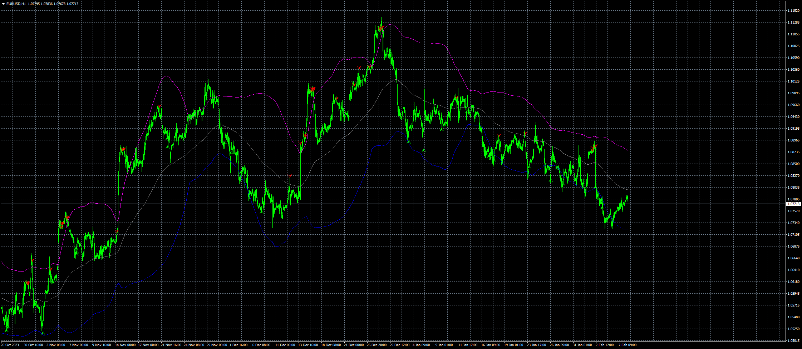
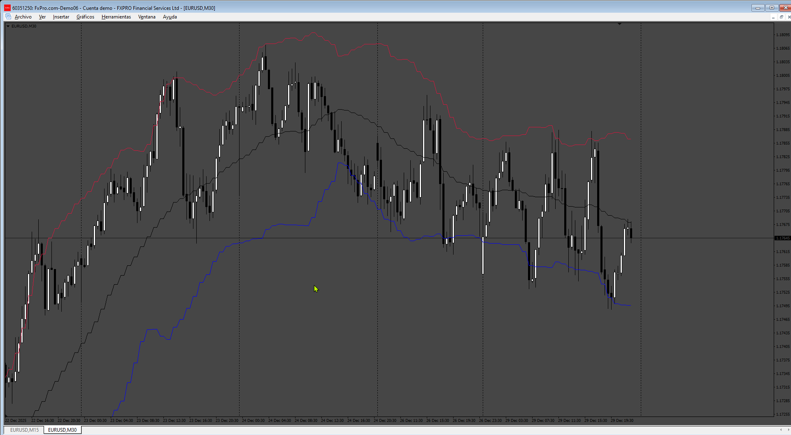

# Extreme_Entry_with_Mean_Reversion_and_Trend_Filter

> Source: https://fxcodebase.com/code/viewtopic.php?f=38&t=74597  
> Forum: 38 · Topic 74597 · 5 post(s)

---

## Extreme_Entry_with_Mean_Reversion_and_Trend_Filter

**Apprentice** · Thu Feb 08, 2024 3:41 am

Based on the request.
[https://fxcodebase.com/code/viewtopic.php?f=27&p=152992](https://fxcodebase.com/code/viewtopic.php?f=27&p=152992)

 [Extreme_Entry_with_Mean_Reversion_and_Trend_Filter.mq4](files/154324/Extreme_Entry_with_Mean_Reversion_and_Trend_Filter.mq4)

---

## Re: Extreme_Entry_with_Mean_Reversion_and_Trend_Filter

**youssef82** · Tue May 07, 2024 7:36 am

bonjour
thanks axepting me on thts forum
can you adding multi time frame to the indicator
thank you

---

## Re: Extreme_Entry_with_Mean_Reversion_and_Trend_Filter

**Apprentice** · Fri May 10, 2024 6:32 am

We have added your request to the development list.
Development reference 362

---

## Re: Extreme_Entry_with_Mean_Reversion_and_Trend_Filter

**youssef82** · Sun May 26, 2024 5:08 pm

good morning my friend
any news about the indicator ?
thank you

---

## Re: Extreme_Entry_with_Mean_Reversion_and_Trend_Filter

**Apprentice** · Wed Dec 31, 2025 10:19 am

 [Extreme_Entry_with_Mean_Reversion_and_Trend_Filter.mq4](files/161464/Extreme_Entry_with_Mean_Reversion_and_Trend_Filter.mq4)
