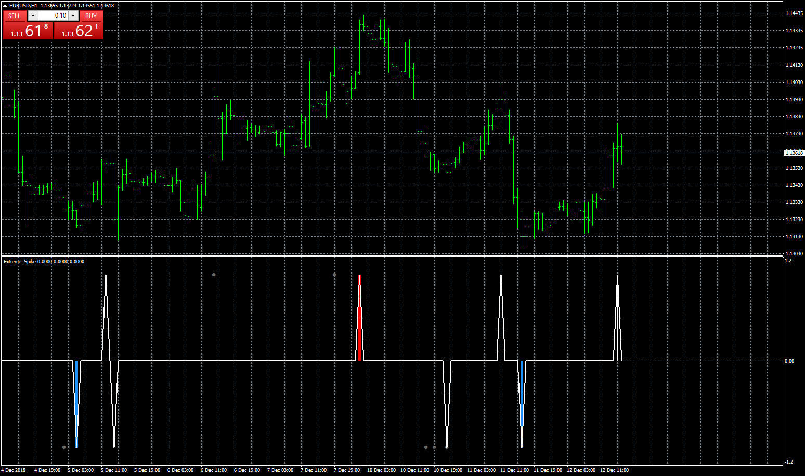
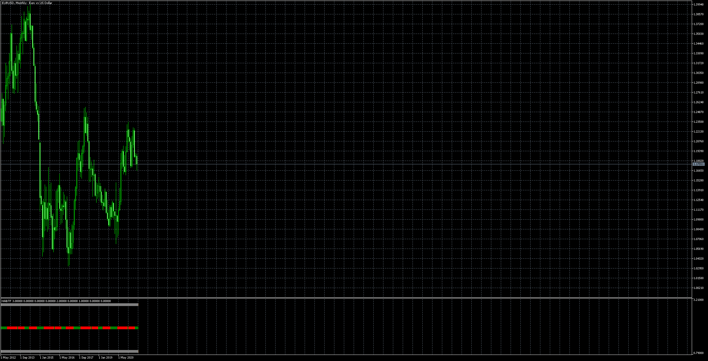

# Extreme_Spike

> Source: https://fxcodebase.com/code/viewtopic.php?f=38&t=67152  
> Forum: 38 · Topic 67152 · 53 post(s)

---

## Extreme_Spike

**Apprentice** · Wed Dec 12, 2018 1:51 pm

 [Extreme_Spike.mq4](files/122745/Extreme_Spike.mq4)

 [Extreme_Spike.mq5](files/122745/Extreme_Spike.mq5)

 [Extreme_Spike EA.mq5](files/122745/Extreme_Spike%20EA.mq5)

 [Extreme_Spike_martingale_EA.mq4](files/122745/Extreme_Spike_martingale_EA.mq4)

---

## Re: Extreme_Spike

**clemmo** · Sat Jul 06, 2019 7:05 pm

This requires AdvancedNotificationsLib.dll. Do you know where we can obtain it?

---

## Re: Extreme_Spike

**Apprentice** · Sun Jul 07, 2019 6:53 am

You can download it here.
[http://profitrobots.com/Home/NotificationsMT4](http://profitrobots.com/Home/NotificationsMT4)

---

## Re: Extreme_Spike

**jmarcs** · Sat May 23, 2020 8:15 am

Hi Apprentice, hope you are doing well
Very good job with your Extreme_Spike.mq4. I very love it, it's awesome!
I used to trade synthetic indices which are available only for MT5 so I have tried to convert it to MT5 version but I did not get the same result as the original ones. Nb: I am not a programmer and I just started learn the mql5 language.

Please do you have it for MT5 ??? Or can you convert it for MT5???

Thanks very much in advance.....

---

## Re: Extreme_Spike

**Apprentice** · Sat May 23, 2020 10:32 am

Your request is added to the development list.
Development reference 1339.

---

## Re: Extreme_Spike

**Apprentice** · Fri Jul 03, 2020 5:00 am

Extreme_Spike.mq5 added.

---

## Re: Extreme_Spike

**jmarcs** · Sat Jul 04, 2020 5:11 am

Hi

Great job

Thanks you very much

---

## Re: Extreme_Spike

**forextraderaz** · Sun Jul 05, 2020 1:11 pm

> **Apprentice wrote:**
>
>
> eurusd-h1-fxcm-australia-pty.png
>
>
>
>
> Extreme_Spike.mq4
>
>
>
>
> Extreme_Spike.mq5

Could you create an MT5 EA based off this indicator? The EA would take trade on extreme spike and close trade on opposite extreme spike.

---

## Re: Extreme_Spike

**Apprentice** · Mon Jul 06, 2020 11:32 am

Your request is added to the development list.
Development reference 1640.

---

## Re: Extreme_Spike

**forextraderaz** · Mon Jul 06, 2020 2:23 pm

> **Apprentice wrote:**
> Your request is added to the development list.
> Development reference 1640.

Thanks

---

## Re: Extreme_Spike

**Apprentice** · Tue Jul 07, 2020 8:36 am

Extreme_Spike EA.mq5 added.

---

## Re: Extreme_Spike

**gosc007** · Thu Aug 13, 2020 8:56 pm

Hi
Can You Plrase convert EA MT5 to EA MT4?

---

## Re: Extreme_Spike

**gosc007** · Thu Aug 13, 2020 9:29 pm

in mt5 ea I have
2020.08.14 02:23:22.728	Renko Extreme_Spike EA (XAUUSD,M1)	invalid pointer access in 'Renko Extreme_Spike EA.mq5' (3468,7)

---

## Re: Extreme_Spike

**Apprentice** · Fri Aug 14, 2020 5:33 am

Your request is added to the development list.
Development reference 1887.

---

## Re: Extreme_Spike

**Bigdawg_trader** · Sun Sep 06, 2020 10:09 pm

> **Apprentice wrote:**
> Extreme_Spike EA.mq5 added.

Is this still available... cannot acccess it...

---

## Re: Extreme_Spike

**Apprentice** · Mon Sep 07, 2020 2:09 am

Can you provide a file of a link to Renko Extreme_Spike EA?
Extreme_Spike_EA.mq5 works without any problem.

---

## Re: Extreme_Spike

**Apprentice** · Tue Sep 08, 2020 3:47 am

I can't repeat MT5 issue.

 [Extreme_Spike EA.mq4](files/137419/Extreme_Spike%20EA.mq4)

---

## Re: Extreme_Spike

**Dewara92** · Mon Dec 14, 2020 6:44 am

> **Apprentice wrote:**
> I can't repeat MT5 issue.
>
>
> Extreme_Spike EA.mq4

Hi there, where can I find the "Extreme_Spike Indicator" as mentioned by the EA.

---

## Re: Extreme_Spike

**Dewara92** · Mon Dec 14, 2020 9:34 am

> **Apprentice wrote:**
> You can download it here.
> [http://profitrobots.com/Home/NotificationsMT4](http://profitrobots.com/Home/NotificationsMT4)

I have got the indicator, blonde moment.
I would like to know can there be a version with no Dll requirement? I won't be sending to Discord or other 3rd party apps.

---

## Re: Extreme_Spike

**Apprentice** · Tue Dec 15, 2020 11:32 am

Your request is added to the development list.
Development reference 2471.

---

## Re: Extreme_Spike

**Apprentice** · Wed Dec 16, 2020 9:54 am

It required only if you will enable these features.
You don't need to install it if you don't use Discord/Telegram.

---

## Re: Extreme_Spike

**Dewara92** · Thu Dec 17, 2020 9:28 am

> **Apprentice wrote:**
> It required only if you will enable these features.
> You don't need to install it if you don't use Discord/Telegram.

Okay thanks, Sorted.

I am facing this problem when loading EA.

It says "Out of memory"

see snippet attached

---

## Re: Extreme_Spike

**jackieta** · Fri Dec 18, 2020 4:45 am

Hi,
Please help to check MT5-EA version. I did backtest on ICmarkets and hit the below errors. Thanks

2020.12.18 16:25:49.032	Core 1	2001.09.24 18:00:00 failed market buy 0.1 EURUSD sl: 0.90850 tp: 0.91450 [Unsupported filling mode]
2020.12.18 16:25:49.032	Core 1	2001.09.24 18:00:00 Failed to open position: Invalid order filling type
2020.12.18 16:25:49.032	Core 1	2001.10.03 19:00:00 failed market buy 0.1 EURUSD sl: 0.91190 tp: 0.91790 [Unsupported filling mode]
2020.12.18 16:25:49.032	Core 1	2001.10.03 19:00:00 Failed to open position: Invalid order filling type
2020.12.18 16:25:49.032	Core 1	2001.10.04 22:00:00 failed market sell 0.1 EURUSD sl: 0.92260 tp: 0.91660 [Unsupported filling mode]
2020.12.18 16:25:49.032	Core 1	2001.10.04 22:00:00 Failed to open position: Invalid order filling type
2020.12.18 16:25:49.032	Core 1	2001.10.08 17:00:00 failed market buy 0.1 EURUSD sl: 0.91460 tp: 0.92060 [Unsupported filling mode]
2020.12.18 16:25:49.032	Core 1	2001.10.08 17:00:00 Failed to open position: Invalid order filling type
2020.12.18 16:25:49.032	Core 1	2001.10.09 18:00:00 failed market buy 0.1 EURUSD sl: 0.91120 tp: 0.91720 [Unsupported filling mode]
2020.12.18 16:25:49.032	Core 1	2001.10.09 18:00:00 Failed to open position: Invalid order filling type

---

## Re: Extreme_Spike

**Apprentice** · Fri Dec 18, 2020 5:11 am

Your request is added to the development list.
Development reference 2488.

---

## Re: Extreme_Spike

**Apprentice** · Sun Dec 20, 2020 9:29 am

There is nothing we can do with that. Your MT5 hit the RAM limit.

---

## Re: Extreme_Spike

**Dewara92** · Wed Dec 23, 2020 2:23 pm

> **Apprentice wrote:**
> There is nothing we can do with that. Your MT5 hit the RAM limit.

Hi Apprentice, I am impressed with the indicator, I tried reading the code to understand.
No luck there.

What is the Simple Basis of Extreme spike?
How is the RED and Blue calculated or found?

Just interested in the thinking

---

## Re: Extreme_Spike

**Chonde** · Tue Apr 13, 2021 2:57 am

> **Apprentice wrote:**
> I can't repeat MT5 issue.
>
>
> Extreme_Spike EA.mq4

Hi @apprentice

Please insert martiangle sistem at this EA

Thanks

---

## Re: Extreme_Spike

**Apprentice** · Tue Apr 13, 2021 1:21 pm

Your request is added to the development list.
Development reference 354.

---

## Re: Extreme_Spike

**Apprentice** · Sun Apr 18, 2021 2:44 am

[Extreme_Spike_martingale_EA.mq5](files/141556/Extreme_Spike_martingale_EA.mq5)

Try this version.

---

## Re: Extreme_Spike

**Sumone** · Wed Jun 02, 2021 4:03 pm

Can you pls add an Extreme_Spike_martingale_EA for MQ4/MT4 platform pls?

---

## Re: Extreme_Spike

**Sumone** · Wed Jun 02, 2021 4:17 pm

Hi Team,
I am happy to find the indicator. Thank you so much. I am in MT4 platform user so is it possible to add an Extreme_Spike_martingale_EA for MQ4? Many blessings

---

## Re: Extreme_Spike

**Apprentice** · Thu Jun 03, 2021 1:48 pm

Your request is added to the development list.
Development reference 550.

---

## Re: Extreme_Spike

**Apprentice** · Tue Jun 08, 2021 10:34 am

Extreme_Spike_martingale_EA added.
[https://fxcodebase.com/code/viewtopic.p ... 45#p122745](https://fxcodebase.com/code/viewtopic.php?f=38&t=67152&p=122745#p122745)

---

## Re: Extreme_Spike

**Sumone** · Tue Jun 08, 2021 10:58 am

> **Apprentice wrote:**
> Extreme_Spike_martingale_EA added.
> [https://fxcodebase.com/code/viewtopic.p ... 45#p122745](https://fxcodebase.com/code/viewtopic.php?f=38&t=67152&p=122745#p122745)

Thank you so much, Dear. You are very helpful

---

## Re: Extreme_Spike

**Sumone** · Wed Jun 09, 2021 11:40 am

> **Apprentice wrote:**
>
>
> eurusd-h1-fxcm-australia-pty.png
>
>
>
>
> Extreme_Spike.mq4
>
>
>
>
> Extreme_Spike.mq5
>
>
>
>
> Extreme_Spike EA.mq5
>
>
>
>
> Extreme_Spike_martingale_EA.mq4

Hi Team,

Does anyone have the Multi Timeframe Indicator of this Extreme Spike in MT4? I was looking in the forum but unable to find it. If anyone can help me locate that would be great.

---

## Re: Extreme_Spike

**Apprentice** · Thu Jun 10, 2021 9:43 am

Multi Timeframe?
To be able to select higher time frames?

---

## Re: Extreme_Spike

**Sumone** · Thu Jun 10, 2021 10:34 am

> **Apprentice wrote:**
> Multi Timeframe?
> To be able to select higher time frames?

So, its like MTF indicator. If the Regular EA is taking the trades on 5 min chart on inky Major spikes (buy side for this example), I want to make sure that the EA has the same signal like Major Spike (buy signal) on 4 hour chart to be more profitable and less repaints/loss. And not to take any trade on the opposite direction of the 4 hour chart. There would be periods of discrepancy when the signal changes from buy to sell on 4 hour chart, but if there is any way to stop the EA during that transition would be great. In that case may be insert 1 hour chart signal, so may be programmed like when 1 hour and 4 hour chart is in alingment of the same direction make the EA take the trade only for that one direction. And when there is a discrepancy in 1 hour chart (sell) and 4 hours Major Spike buy, the EA running on a 5 min chart or 15 mins chart will not take any trades. There can be an option on the EA whether the trader wants the EA to take the trades even when there is a signal discrepancy like True/False. Does that make any sense? Will that be more profitable ? I didn't run any simulation, just a concept. If anyone has any other suggestions, pls share here so that we can build a better EA from every one to be profitable. The new EA will only take trades on Major Spikes of buy or sell on lower time frame in conjunction with the higher time frames Major spike (buy/sell) direction. Also in the EA, trader will have the option which higher time frame to chose like s/he can set up 1 hour as higher time frame, 5 min to trade and not to take when 30 min time frame Major spikes for discrepancy measurement of not to take any trade when signals are not aligned in the same direction .

---

## Re: Extreme_Spike

**Apprentice** · Sun Jun 13, 2021 7:17 am

Your request is added to the development list.
Development reference 573.

---

## Re: Extreme_Spike

**Sumone** · Sun Jun 13, 2021 3:18 pm

> **Apprentice wrote:**
> Your request is added to the development list.
> Development reference 573.

Hi Apprentice,

Here is the observation I made with extreme spike, and for better accuracy to enter and exit trades and moreover when not to take trades I added Hiekn Ashi time frame and then follow the CCI+Fast Stochastics whichever signals last to enter and exit the trade. Here is the layman's Logic. If it is possible to make it in an EA, that would be great

#######LOGIC#####
sell side 1 min:

When the #MTF Heiken_Ashi M1 color is red it will only take sell-side trades on extreme spike indicator Major TOP Red spike (CCI has to below +100 and fast stochastics green line below 80 marks whichever comes last) with stop loss above the Major top. If the #MTF Heiken_Ashi M1 color is still red, but the extreme spike indicator signals Major blue bottom the EA will close the trade and wait for the sell-side trade with the same above condition.

The EA will not engage in any buy trade while the #MTF Heiken_Ashi M1 color is red. Only close at extreme spike indicator signals Major blue bottom and enter sell-side trades on extreme spike indicator, Major TOP Red.

Sometimes the extreme spike indicator changes into blue color, signaling major bottom after a few minutes of minor trade signal. So in this case the EA will close the sell-side trade whenever the extreme spike indicator changes into blue. This feature will protect the profit of the sell-side trade.

EA WILL NOT TO TRADE:
When the CCI doesn't come down from the above +100 zone, the EA will not take sell trade to avoid Choppy trade and multiple short trades due to market indecision. ( see choppy trade screenshot)

When the fast stochastic (GREEN LINE) doesn't come down from the above +80 zone, the EA will not take sell trade to avoid Choppy trade and multiple short trades due to market indecision. (see choppy trade screenshot)

Buy Side 1 min:

When the #MTF Heiken_Ashi M1 color is blue it will only take buy-side trades on extreme spike indicator Major BOTTOM Blue spike (CCI has to above -100 and fast stochastics green line above 20 marks whichever comes last) with stop loss below the Major bottom. If the #MTF Heiken_Ashi M1 color is still blue, but the extreme spike indicator signals Major Red top the EA will close the trade and wait for the buy-side trade with the same above condition.

The EA will not take any sell trade while the #MTF Heiken_Ashi M1 color is blue. Only close at extreme spike indicator signals Major Red Top and enter buy-side trades on extreme spike indicator, Major Bottom Blue.

Sometimes the extreme spike indicator changes into red color, signaling major bottom after a few minutes of minor trade signal. So in this case the EA will close the buy-side trade whenever the extreme spike indicator changes into the blue to protect the profit. This feature will protect the profit of the buy-side trade.

EA WILL NOT TRADE:
When the CCI doesn't come up from below the -100 zone, the EA will not take sell trade to avoid Choppy trade and multiple short trades due to market indecision.

When the fast stochastic doesn't come UP (GREEN LINE) from below 20 zone, the EA will not take sell trade to avoid Choppy trade and multiple short trades due to market indecision.

---

## Re: Extreme_Spike

**Sumone** · Tue Jun 15, 2021 6:44 am

For a better entry and exit and to avoid the repaint of the extreme indicator for the position open and close, one can replace the fast stochastic with a regular or slow stochastic . That means in the logic where it said fast stochastic, it has to be programmed with regular stochastic. And the logic would be the same, crossing over 80 lines or coming beneath 20 lines to enter a trade. The only drawback is since we are getting less repaint, and delayed entry for a better position, the stop loss needs to be wider to work it out. I ran both the fast and the regular stochastic. The fast stochastic will give a real-time view when the indicator is flapping up and down and the extreme indicator starts to repaint. But if we follow regular stochastic, then it is way less repaint with better accuracy. Below is the screenshot. Also, I added all the indicators I talked about in the logic.

Can we make the EA then ?

> **Sumone wrote:**
>
>
> > **Apprentice wrote:**
> > Your request is added to the development list.
> > Development reference 573.
>
>
>
> Hi Apprentice,
>
> Here is the observation I made with extreme spike, and for better accuracy to enter and exit trades and moreover when not to take trades I added Hiekn Ashi time frame and then follow the CCI+Fast Stochastics whichever signals last to enter and exit the trade. Here is the layman's Logic. If it is possible to make it in an EA, that would be great
>
> #######LOGIC#####
> sell side 1 min:
>
> When the #MTF Heiken_Ashi M1 color is red it will only take sell-side trades on extreme spike indicator Major TOP Red spike (CCI has to below +100 and fast stochastics green line below 80 marks whichever comes last) with stop loss above the Major top. If the #MTF Heiken_Ashi M1 color is still red, but the extreme spike indicator signals Major blue bottom the EA will close the trade and wait for the sell-side trade with the same above condition.
>
> The EA will not engage in any buy trade while the #MTF Heiken_Ashi M1 color is red. Only close at extreme spike indicator signals Major blue bottom and enter sell-side trades on extreme spike indicator, Major TOP Red.
>
> Sometimes the extreme spike indicator changes into blue color, signaling major bottom after a few minutes of minor trade signal. So in this case the EA will close the sell-side trade whenever the extreme spike indicator changes into blue. This feature will protect the profit of the sell-side trade.
>
> EA WILL NOT TO TRADE:
> When the CCI doesn't come down from the above +100 zone, the EA will not take sell trade to avoid Choppy trade and multiple short trades due to market indecision. ( see choppy trade screenshot)
>
> When the fast stochastic (GREEN LINE) doesn't come down from the above +80 zone, the EA will not take sell trade to avoid Choppy trade and multiple short trades due to market indecision. (see choppy trade screenshot)
>
> Buy Side 1 min:
>
> When the #MTF Heiken_Ashi M1 color is blue it will only take buy-side trades on extreme spike indicator Major BOTTOM Blue spike (CCI has to above -100 and fast stochastics green line above 20 marks whichever comes last) with stop loss below the Major bottom. If the #MTF Heiken_Ashi M1 color is still blue, but the extreme spike indicator signals Major Red top the EA will close the trade and wait for the buy-side trade with the same above condition.
>
> The EA will not take any sell trade while the #MTF Heiken_Ashi M1 color is blue. Only close at extreme spike indicator signals Major Red Top and enter buy-side trades on extreme spike indicator, Major Bottom Blue.
>
> Sometimes the extreme spike indicator changes into red color, signaling major bottom after a few minutes of minor trade signal. So in this case the EA will close the buy-side trade whenever the extreme spike indicator changes into the blue to protect the profit. This feature will protect the profit of the buy-side trade.
>
> EA WILL NOT TRADE:
> When the CCI doesn't come up from below the -100 zone, the EA will not take sell trade to avoid Choppy trade and multiple short trades due to market indecision.
>
> When the fast stochastic doesn't come UP (GREEN LINE) from below 20 zone, the EA will not take sell trade to avoid Choppy trade and multiple short trades due to market indecision.

---

## Re: Extreme_Spike

**Yaya20** · Sat Aug 21, 2021 4:33 pm

Hi, I was wondering if it would be possible to make an MT5 indicator of the Heiken Ashi MTF from this thread ?
Thanks SO much, and really appreciate the effort of the coders here:))

---

## Re: Extreme_Spike

**Apprentice** · Mon Aug 23, 2021 3:11 am

Your request is added to the development list.
Development reference 766.

---

## Re: Extreme_Spike

**Apprentice** · Wed Aug 25, 2021 1:08 pm

 [Heiken_Ashi_heatmap.mq5](files/143362/Heiken_Ashi_heatmap.mq5)

---

## Re: Extreme_Spike

**MusaririNdlovu** · Fri Mar 18, 2022 6:34 am

Hie the extreme spike mq5 is not showing the shadow dots and i trade with them is it possible to fix that? Thank you very much in advance.

---

## Re: Extreme_Spike

**MusaririNdlovu** · Mon Apr 04, 2022 1:20 pm

This indicator is not the same as MT4 version.The mq5 does not show some Highs or Lows at some point it show 2 consecative lows or highs i think there must be an error

---

## Re: Extreme_Spike

**marmnt300** · Fri Apr 08, 2022 3:17 am

Thanks Admin (Apprentice) I will try this

---

## Re: Extreme_Spike

**Kinslay** · Mon Jun 20, 2022 9:01 am

Hello,

I want to request some info about the indicator signals and when they occur.

For what i saw so far there 4 different types of signals (shown in the image): dot, angle plain, angle with line, angle with bar.

Is it possible to know when these signals are generated and when they get invalidated exactly?

Many thanks in advance.

Regards

---

## Re: Extreme_Spike

**Apprentice** · Mon Jun 20, 2022 11:18 am

We have added your request to the development list.
Development reference 362.

---

## Re: Extreme_Spike

**cjone003** · Wed Apr 19, 2023 9:59 am

> **Apprentice wrote:**
>
>
> eurusd-h1-fxcm-australia-pty.png
>
>
>
>
> Extreme_Spike.mq4
>
>
>
>
> Extreme_Spike.mq5
>
>
>
>
> Extreme_Spike EA.mq5
>
>
>
>
> Extreme_Spike_martingale_EA.mq4

Hello, I'm having trouble using the Martingale EA mq4, I can't get it to take a trade, and also, I'm wondering if the Ea can be made with non-repaint option as in the indicator. As I only use the indicator in this mode No Repaint= true, and need the EA to function with no-repaint option. Thank you!

---

## Re: Extreme_Spike

**Apprentice** · Sat Apr 22, 2023 12:15 pm

We have added your request to the development list.
Development reference 358.

---

## Re: Extreme_Spike

**garry119** · Fri May 16, 2025 11:38 am

> **Apprentice wrote:**
>
>
> eurusd-h1-fxcm-australia-pty.png
>
>
>
>
> Extreme_Spike.mq4
>
>
>
>
> Extreme_Spike.mq5
>
>
>
>
> Extreme_Spike EA.mq5
>
>
>
>
> Extreme_Spike_martingale_EA.mq4

Hello Apprentice. Could you add signal filter to Extreme Spike? If the closing price of the bar at which the signal is in the bai higher than the price of closing the bar on the previous signal in the bai, then an additional arrow in the bai is placed. If the closing price of the bar at which the signal in Sell is lower than the price of closing the bar on the previous signal to Sell,
then an additional arrow in Sell is put. That is, it would be nice to highlight the trend factor on the signals

---

## Re: Extreme_Spike

**Apprentice** · Sat May 17, 2025 11:01 am

We have added your request to the development list.
Development reference 328

---

## Re: Extreme_Spike

**Apprentice** · Wed Jun 04, 2025 3:14 pm

[Extreme_Spike_v2.mq4](files/159446/Extreme_Spike_v2.mq4)

Try this version.
