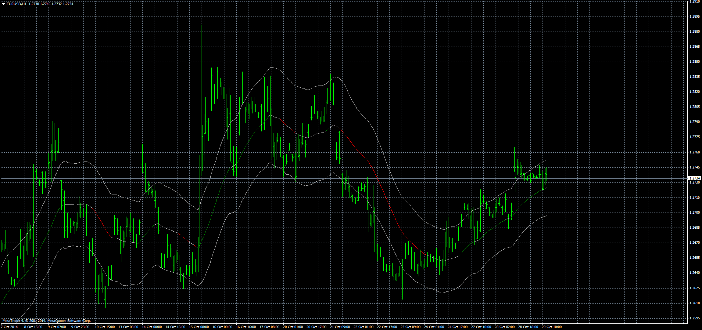
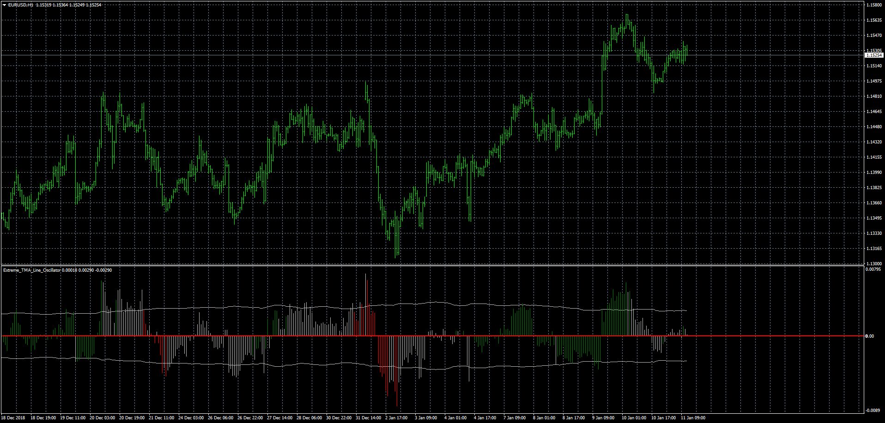

# Extreme TMA line indicator

> Source: https://fxcodebase.com/code/viewtopic.php?f=38&t=61392  
> Forum: 38 · Topic 61392 · 11 post(s)

---

## Extreme TMA line indicator

**Apprentice** · Wed Oct 29, 2014 6:54 am

Based on Lua template.
[viewtopic.php?f=17&t=59406](https://fxcodebase.com/code/viewtopic.php?f=17&t=59406)

 [Extreme_TMA_Line.mq4](files/96801/Extreme_TMA_Line.mq4)

---

## Extreme_TMA_Line_Oscillator

**Apprentice** · Fri Jan 11, 2019 9:49 am

 [Extreme_TMA_Line_Oscillator.mq4](files/123310/Extreme_TMA_Line_Oscillator.mq4)

---

## Re: Extreme TMA line indicator

**Gilles** · Wed Jul 06, 2022 4:56 am

Hi Apprentice,

It will be possible to convert Extreme_TMA_Line_Oscillator.mq4 to LUA version please ?

Thank you for this very interesting work :) !

---

## Re: Extreme TMA line indicator

**Gilles** · Thu Jul 07, 2022 8:30 am

Hi Apprentice,
I worked on creating the extreme_tma_line_oscillator for lua and I don't get the same as you.
Could you take a look at it and tell me where the error is.
Thank you very much.

---

## Re: Extreme TMA line indicator

**Apprentice** · Fri Jul 08, 2022 3:28 am

[Extreme_TMA_line_Oscillator.lua](files/146645/Extreme_TMA_line_Oscillator.lua)

Try this version.

---

## Re: Extreme TMA line indicator

**Gilles** · Fri Jul 08, 2022 12:33 pm

Hi Apprentice,
Thank you very much for giving me a moment to watch/modify my code based on the one you had proposed for the MACD.
It is a code structure that I thought was valid and the mofications made to it are of great relevance. Thank you very much Apprentice, it is an honor to exchange with you.

---

## Re: Extreme TMA line indicator

**Gilles** · Tue Jul 19, 2022 12:15 pm

Hi Apprentice,
As for ATR_adaptive_period could we have a Extreme_TMA_Line_adaptive_period for Lua ?
Thank you very much Apprentice.
See you soon :)!

---

## Re: Extreme TMA line indicator

**Apprentice** · Wed Jul 20, 2022 7:10 am

Extreme_TMA_Line_adaptive_period is based on what code?
[https://fxcodebase.com/code/viewtopic.php?f=17&t=59406](https://fxcodebase.com/code/viewtopic.php?f=17&t=59406)

---

## Variation Extreme TMA line indicator for MT4

**Gilles** · Wed Jun 28, 2023 5:33 am

Hi Apprentice,
Will we be able to obtain the Extreme_TMA_Line.mq4 indicator with automatic smoothing activation of the line after each tick?

Next, I propose a variation of the indicator by incorporating the following elements:

With:
FullLength = 2 * HalfLength + 1.
upBuffer[period] = tmBuffer[period] + 6 * source:pipSize();
dnBuffer[period] = tmBuffer[period] - 6 * source:pipSize();

if tmBuffer[period] > tmBuffer[period-FullLength+1], then tmBuffer = green and upTrend = true
elseif tmBuffer[period] < tmBuffer[period-FullLength+1], then tmBuffer = red and upTrend = false
end

As long as upTrend is "true":
Place a green arrow to buy on dnBuffer[period] every time the price touches this line.

As long as upTrend is "false":
Place a red arrow to sell on upBuffer[period] every time the price touches this line.

The fact that the Extreme_TMA_Line indicator repaints will facilitate market visualization and the progression of its evolution through smoothing after each tick.
Thank you in advance :)

---

## Re: Extreme TMA line indicator

**Apprentice** · Sat Jul 01, 2023 6:07 am

We have added your request to the development list.
Development reference 574.

---

## Re: Extreme TMA line indicator

**Apprentice** · Mon Jul 17, 2023 2:37 pm

Try this version.
[https://fxcodebase.com/code/viewtopic.php?f=38&t=73942](https://fxcodebase.com/code/viewtopic.php?f=38&t=73942)
