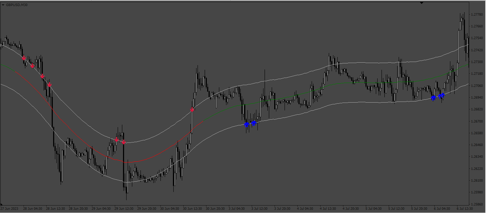
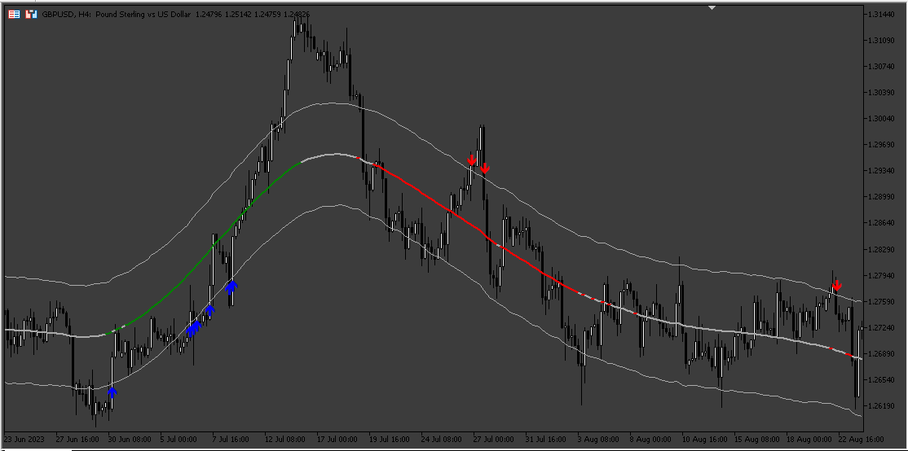
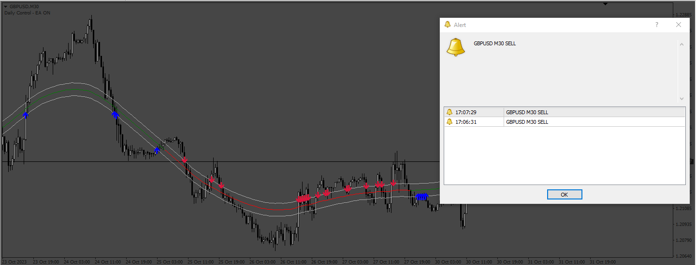

# Extreme_TMA_Variations

> Source: https://fxcodebase.com/code/viewtopic.php?f=38&t=73942  
> Forum: 38 · Topic 73942 · 14 post(s)

---

## Extreme_TMA_Variations

**Apprentice** · Mon Jul 17, 2023 2:35 pm

Based on the request.
[https://fxcodebase.com/code/viewtopic.php?f=38&p=151445](https://fxcodebase.com/code/viewtopic.php?f=38&p=151445)

 [Extreme_TMA_Variations.mq4](files/151671/Extreme_TMA_Variations.mq4)

 

 [Extreme_TMA_Variations_MT5.mq5](files/151671/Extreme_TMA_Variations_MT5.mq5)

 [Extreme_TMA_Variations_MT5 with Alert.mq5](files/151671/Extreme_TMA_Variations_MT5%20with%20Alert.mq5)

---

## Re: Extreme_TMA_Variations

**gyrics** · Thu Aug 03, 2023 10:55 pm

Kindly make available MT5 version
Thank You

---

## Re: Extreme_TMA_Variations

**Apprentice** · Tue Aug 08, 2023 3:51 am

We have added your request to the development list.
Development reference 688.

---

## Re: Extreme_TMA_Variations

**tkhanfx** · Sun Sep 10, 2023 5:40 pm

> **Apprentice wrote:**
>
>
> 574pic.png
>
>
> Based on the request.
> [https://fxcodebase.com/code/viewtopic.php?f=38&p=151445](https://fxcodebase.com/code/viewtopic.php?f=38&p=151445)
>
>
> Extreme_TMA_Variations.mq4

This version the signals seem to repaint, once the indicator has been loaded on the chart and allowed to run for sometime some signals disappear when i change the timeframe and revert back. is it possible to maintain the current integrity and position of the signals and have them not repaint?

Thank you

---

## Re: Extreme_TMA_Variations

**Apprentice** · Mon Sep 11, 2023 4:55 am

MT5 version added.

---

## Re: Extreme_TMA_Variations

**tkhanfx** · Tue Sep 12, 2023 6:52 am

> **Apprentice wrote:**
>
>
> 574pic.png
>
>
> Based on the request.
> [https://fxcodebase.com/code/viewtopic.php?f=38&p=151445](https://fxcodebase.com/code/viewtopic.php?f=38&p=151445)
>
>
> Extreme_TMA_Variations.mq4
>
>
>
>
> 688.png
>
>
>
>
> Extreme_TMA_Variations_MT5.mq5

This version the signals repaint, once the indicator is loaded and left to run some of the signals on the chart disappear when i change the time frame and revert back. is it possible to solve this issue without changing the current position and integrity of the signals?

Thank you

---

## Re: Extreme_TMA_Variations

**Apprentice** · Tue Sep 12, 2023 10:35 am

Not likely.

---

## Re: Extreme_TMA_Variations

**rafter_1** · Wed Sep 27, 2023 8:51 pm

Hello Apprentice. Is it possible to add an alert?

Notification when arrow is dropped on chart. I have tried different snippets, but can't get it to work correctly. Code shown is from the indicator.
Example_
 double newrange = pipRange * 10 * _Point;
 Top[i] = TMA[i] + newrange;
 Bottom[i] = TMA[i] - newrange;

 if((Close[i] <= Bottom[i] && Open[i] >= Bottom[i]) || (Close[i] >= Bottom[i] && Open[i] <= Bottom[i])) {
 ArrowUp[i] = Bottom[i];
 Notifications(0);//add notification
 }
 if(haveSignalUp(i)) {
 ArrowUp[i] = Low[i]-10*_Point;

 }

 //if(Up[i+1] != EMPTY_VALUE) {
 //if((Close[i] >= Top[i] && Open[i] <= Top[i]) || (Close[i] <= Top[i] && Open[i] >= Top[i])) {
 //ArrowDn[i] = Top[i];
 if(haveSignalDown(i)) {
 ArrowDn[i] = High[i]+10*_Point;
 Notifications(1);
 // Notifications(0);
 }
 //}

 // }
 }

 //---- done
 return(0);
}

void Notifications(int type)
{
 string text = "Xtreme-MA: ";
 if (type == 0) text += _Symbol + " " + " BUY ";
 else text += _Symbol + " " + " SELL ";

 text += " ";
 if(NewBar()) {
 if (!notifications)
 return;
 if (desktop_notifications)
 Alert(text);
 if (push_notifications)
 SendNotification(text);
 if (email_notifications)
 SendMail("MetaTrader Notification", text);
 Sleep(1000);
 if (sound_notifications)
 PlaySound("CarHorn3toots.wav");
 }
}

---

## Re: Extreme_TMA_Variations

**rafter_1** · Wed Sep 27, 2023 9:50 pm

Hello Apprentice. Is it possible to add an alert?

I use the bands only (main line = nocolor), in conjunction with a second set of bands. I find it works well, but an alert would be wonderful.

The Alert
Notification when arrow is dropped on chart candle. Multiple arrows on multiple candles is multiple notifications, once per candle with NewBar().

I have tried different snippets, but can't get it to work correctly. Code shown is from the indicator.

Example_
 double newrange = pipRange * 10 * _Point;
 Top[i] = TMA[i] + newrange;
 Bottom[i] = TMA[i] - newrange;

 if((Close[i] <= Bottom[i] && Open[i] >= Bottom[i]) || (Close[i] >= Bottom[i] && Open[i] <= Bottom[i])) {
 ArrowUp[i] = Bottom[i];
 Notifications(0);//add notification here or somewhere
 }

 if((Close[i] >= Top[i] && Open[i] <= Top[i]) || (Close[i] <= Top[i] && Open[i] >= Top[i])) {
 ArrowDn[i] = Top[i];
 Notifications(1);//add notification here or somewhere
 }
 }

 //---- done
 return(0);
}

void Notifications(int type) //this is your function with my modification
{
 string text = "Xtreme-MA: ";
 if (type == 0) text += _Symbol + " " + " BUY ";
 else text += _Symbol + " " + " SELL ";

 text += " ";
 if(NewBar()) { //here
 if (!notifications)
 return;
 if (desktop_notifications)
 Alert(text);
 if (push_notifications)
 SendNotification(text);
 if (email_notifications)
 SendMail("MetaTrader Notification", text);
 Sleep(1000); //here, 3 lines for sound
 if (sound_notifications)
 PlaySound("CarHorn3toots.wav");
 }
}

bool NewBar() //this function is imbedded in Notification().
 {
 static datetime time=0;
 if(time==0)
 {
 time=Time[0];
 return false;
 }
 if(time!=Time[0])
 {
 time=Time[0];
 return true;
 }
 return false;
 }

Thankyou for you time and herculean effort.
Regards.

---

## Re: Extreme_TMA_Variations

**Apprentice** · Sat Sep 30, 2023 2:50 am

We have added your request to the development list.
Development reference 880.

---

## Re: Extreme_TMA_Variations

**Apprentice** · Sun Oct 08, 2023 3:12 am

Extreme_TMA_Variations_MT5 with Alert added.
[https://fxcodebase.com/code/viewtopic.php?f=38&t=73942](https://fxcodebase.com/code/viewtopic.php?f=38&t=73942)

---

## Re: Extreme_TMA_Variations

**rafter_1** · Tue Oct 17, 2023 11:10 pm

[Extreme_TMA_Variations_MT5 _rafterMOD_Alert.mq5](files/152968/Extreme_TMA_Variations_MT5%20_rafterMOD_Alert.mq5)

Hello Apprentice. Thanks for your effort regarding Extreme_TMA_Variations_MQL5_withAlert.mql5. After observing for a couple of days without any alerts poping up, I figured to look under the hood. And what I found, the notifications were all turned off. So....I modified code for the alerts and added extra inputs. Added code for sound. All is working now.

I tried to convert to mt4. The file compiled, except for the CopyBuffer(), which I could not figure a work around (I am not a big time coder).

I am requesting the mql5 be converted to mt4, as that is the platform I use. I did not specify which platform in my last request. My error.

Thankyou,
Regards,
rafter

---

## Re: Extreme_TMA_Variations

**Apprentice** · Sat Oct 21, 2023 9:26 am

We have added your request to the development list.
Development reference 952

---

## Re: Extreme_TMA_Variations

**Apprentice** · Wed Nov 01, 2023 4:18 pm

 [Extreme_TMA_Variations_alerts.mq4](files/153150/Extreme_TMA_Variations_alerts.mq4)
