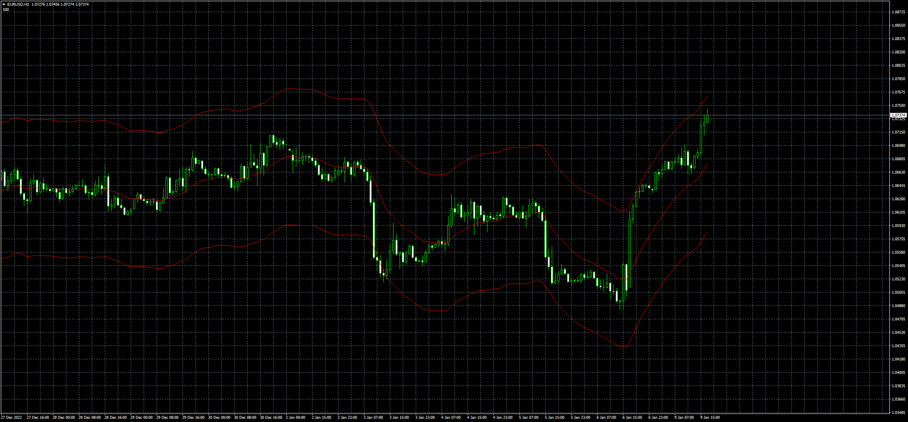

# ExtremePrice

> Source: https://fxcodebase.com/code/viewtopic.php?f=38&t=73154  
> Forum: 38 · Topic 73154 · 4 post(s)

---

## ExtremePrice

**Apprentice** · Mon Jan 09, 2023 10:26 am

Based on request.
[https://fxcodebase.com/code/viewtopic.php?f=27&p=148862](https://fxcodebase.com/code/viewtopic.php?f=27&p=148862)

 [ExtremePrice.mq4](files/148984/ExtremePrice.mq4)

 [ExtremePrice.mq5](files/148984/ExtremePrice.mq5)

---

## Re: ExtremePrice

**rgarcia** · Tue Oct 10, 2023 3:39 pm

Thanks for the indicators, now I want to make an EA's (MT4 and MT5) based on this indicators
thanks a lot

---

## Re: ExtremePrice

**Apprentice** · Thu Oct 12, 2023 3:31 am

We have added your request to the development list.
Development reference 911

---

## Re: ExtremePrice

**Apprentice** · Fri Nov 24, 2023 3:05 am

[ExtremePrice_EA_v1.00.mq4](files/153388/ExtremePrice_EA_v1.00.mq4)

 [ExtremePrice_EA_v1.00.mq5](files/153388/ExtremePrice_EA_v1.00.mq5)

Try this versions.
