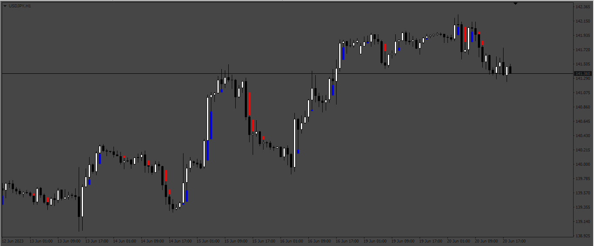
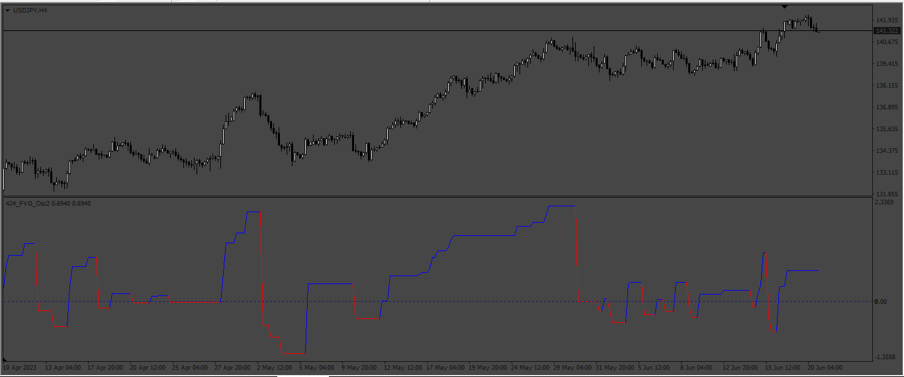
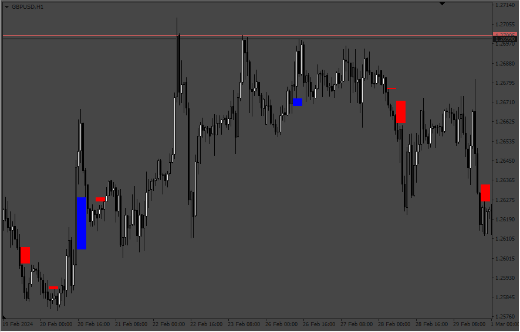
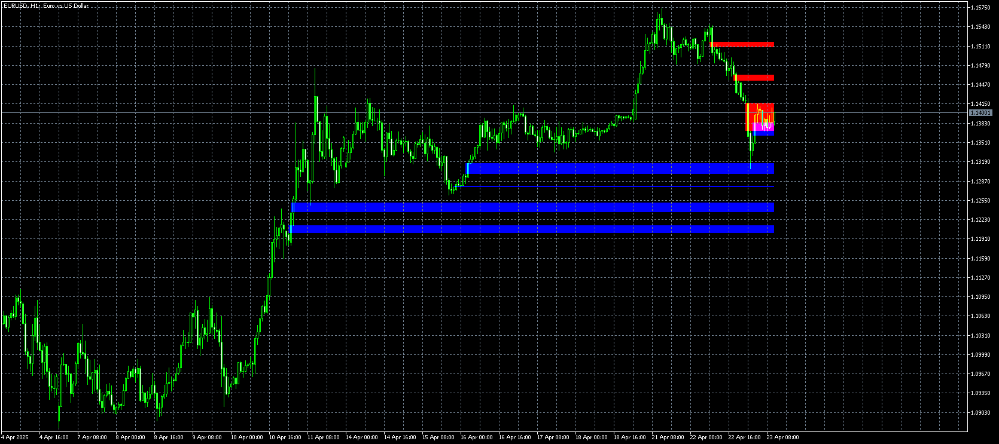
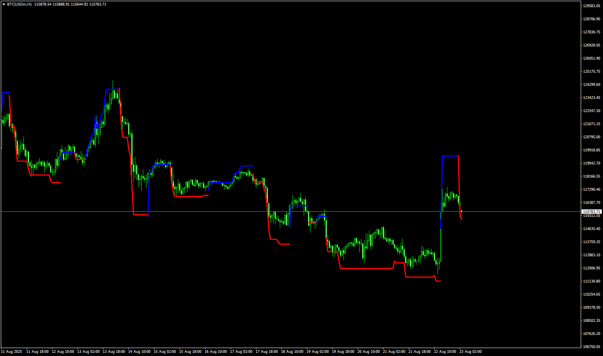
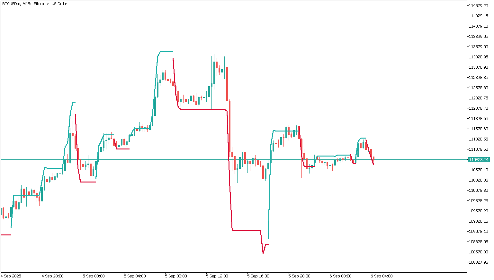
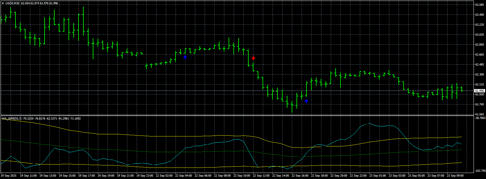
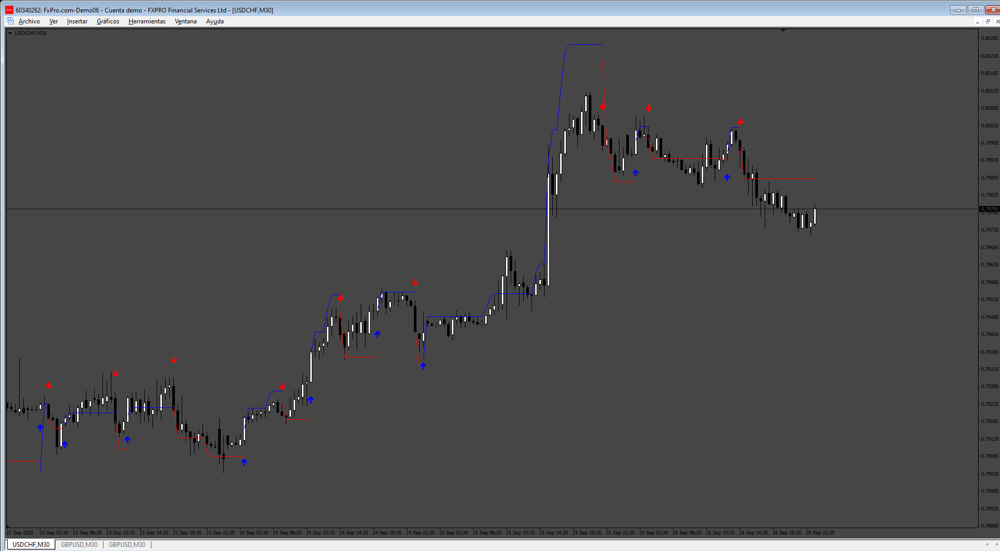

# Fair Value Gaps

> Source: https://fxcodebase.com/code/viewtopic.php?f=38&t=73871  
> Forum: 38 · Topic 73871 · 24 post(s)

---

## Fair Value Gaps

**Apprentice** · Mon Jun 26, 2023 3:06 pm

 

Based on the TS2 version.
[https://fxcodebase.com/code/viewtopic.php?f=17&p=150757](https://fxcodebase.com/code/viewtopic.php?f=17&p=150757)

 [FVG.mq4](files/151420/FVG.mq4)

 [FVG_Oscillator.mq4](files/151420/FVG_Oscillator.mq4)

 [FVG.mq5](files/151420/FVG.mq5)

 [FVG_Oscillator.mq5](files/151420/FVG_Oscillator.mq5)

---

## Re: Fair Value Gaps

**tmue2014** · Fri Jun 30, 2023 12:41 am

Thanks a lot - much appreciated!

---

## Re: Fair Value Gaps

**PyremR** · Fri Feb 16, 2024 2:26 am

I just created an account to thank you for your contribution! I will get a better idea on how to create this in the way I want. I was stuck on the logic

---

## Re: Fair Value Gaps

**FabrizioPRO77** · Sat Feb 24, 2024 11:36 am

Hi Mario, thanks for your work, I wanted to ask you if it was possible to have the FVG indicator for metatrader4 in multi time frame format.

Thanks if you can.

Fabrizio

---

## Re: Fair Value Gaps

**Apprentice** · Sat Feb 24, 2024 2:21 pm

We have added your request to the development list.
Development reference 170

---

## Re: Fair Value Gaps

**FabrizioPRO77** · Sun Feb 25, 2024 4:03 am

> **Apprentice wrote:**
> We have added your request to the development list.
> Development reference 170

First of all, thank you.

I just wanted to ask if I just need to follow this post because the fvg mtf indicator will be put here or if I have to do something else.

Thank you

Fabrizio

---

## Re: Fair Value Gaps

**Apprentice** · Sat Mar 09, 2024 9:36 am

 [FVG_MTF.mq4](files/154613/FVG_MTF.mq4)

---

## Re: Fair Value Gaps

**pkoolc1** · Thu Nov 28, 2024 8:30 am

> **Apprentice wrote:**
>
>
> The attachment **170.png** is no longer available
>
>
>
>
> The attachment **170.png** is no longer available

Please make this one MTF, attached

---

## Re: Fair Value Gaps

**Apprentice** · Thu Dec 05, 2024 1:45 pm

We have added your request to the development list.
Development reference 903

---

## Re: Fair Value Gaps

**Apprentice** · Wed Apr 23, 2025 3:41 am

 [FVG_mtf.mq5](files/159014/FVG_mtf.mq5)

---

## Re: Fair Value Gaps

**Teruyoshi** · Thu Aug 14, 2025 10:46 am

s it possible to get FVG_Oscillator.mq4 to show on the main chart intead of subwindow?
Many thanks to your generousity and kindnesses.

---

## Re: Fair Value Gaps

**Apprentice** · Mon Aug 18, 2025 7:14 am

We have added your request to the development list.
Development reference 521

---

## Re: Fair Value Gaps

**Apprentice** · Mon Aug 25, 2025 3:25 am

 [FVG_Oscillator.mq4](files/160344/FVG_Oscillator.mq4)

---

## Re: Fair Value Gaps

**khanatd** · Wed Aug 27, 2025 2:05 pm

plz mt4 version of it with arrows at close of live current candle only, thanks

khan

---

## Re: Fair Value Gaps

**marcelo2k9** · Wed Aug 27, 2025 2:25 pm

This is beautiful, please Sir can you make us the mt5 version?

---

## Re: Fair Value Gaps

**Apprentice** · Sun Aug 31, 2025 3:38 am

We have added your request to the development list.
Development reference 556

---

## Re: Fair Value Gaps

**khanatd** · Sun Aug 31, 2025 9:48 pm

hi sir , plz add arrows at reversal and continuation too, mt4

thanks a lot
khan

---

## Re: Fair Value Gaps

**Apprentice** · Thu Sep 04, 2025 5:05 am

We have added your request to the development list.
Development reference 565

---

## Re: Fair Value Gaps

**Apprentice** · Tue Sep 09, 2025 3:36 am

 [FVG_Oscillator.mq5](files/160504/FVG_Oscillator.mq5)

---

## Re: Fair Value Gaps

**khanatd** · Sat Sep 13, 2025 2:08 am

sir reminder for arrows in it mt4 kindly

---

## Re: Fair Value Gaps

**khanatd** · Sun Sep 14, 2025 8:11 pm

sir plz mt4 version with arrows too non repaint

---

## Re: Fair Value Gaps

**Apprentice** · Mon Sep 15, 2025 12:34 pm

We have added your request to the development list.
Development reference 582

---

## Re: Fair Value Gaps

**Apprentice** · Tue Sep 23, 2025 2:53 am

 [FVG_Oscillator_v2.mq4](files/160586/FVG_Oscillator_v2.mq4)

---

## Re: Fair Value Gaps

**Apprentice** · Sat Sep 27, 2025 3:56 pm

Task 565

 [FVG_Oscillator_arrows.mq4](files/160642/FVG_Oscillator_arrows.mq4)
