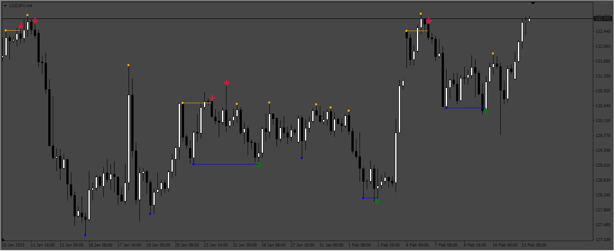

# False_Breackout_Detector

> Source: https://fxcodebase.com/code/viewtopic.php?f=38&t=73389  
> Forum: 38 · Topic 73389 · 6 post(s)

---

## False_Breackout_Detector

**Apprentice** · Thu Feb 16, 2023 3:01 pm

Based on the request.
[https://fxcodebase.com/code/viewtopic.php?f=17&t=73344](https://fxcodebase.com/code/viewtopic.php?f=17&t=73344)

 [False_Breackout_Detector.mq4](files/149659/False_Breackout_Detector.mq4)

TS2 version.
[https://fxcodebase.com/code/viewtopic.php?f=17&t=74917](https://fxcodebase.com/code/viewtopic.php?f=17&t=74917)

---

## Re: False_Breackout_Detector

**ahmedalhosenyy** · Wed Jun 07, 2023 10:57 am

Many Thanks

---

## Re: False_Breackout_Detector

**ahmedalhosenyy** · Tue Aug 29, 2023 12:37 pm

Hello,
May you translate it to LUA indicator

thanks in advance

---

## Re: False_Breackout_Detector

**Apprentice** · Sat Sep 02, 2023 5:17 am

We have added your request to the development list.
Development reference 804.

---

## Re: False_Breackout_Detector

**ahmedalhosenyy** · Mon Oct 23, 2023 12:56 pm

Hello,
Any news about LUA version

thanks alot

---

## Re: False_Breackout_Detector

**Apprentice** · Sun May 26, 2024 9:20 am

TS2 version.
[https://fxcodebase.com/code/viewtopic.php?f=17&t=74917](https://fxcodebase.com/code/viewtopic.php?f=17&t=74917)
