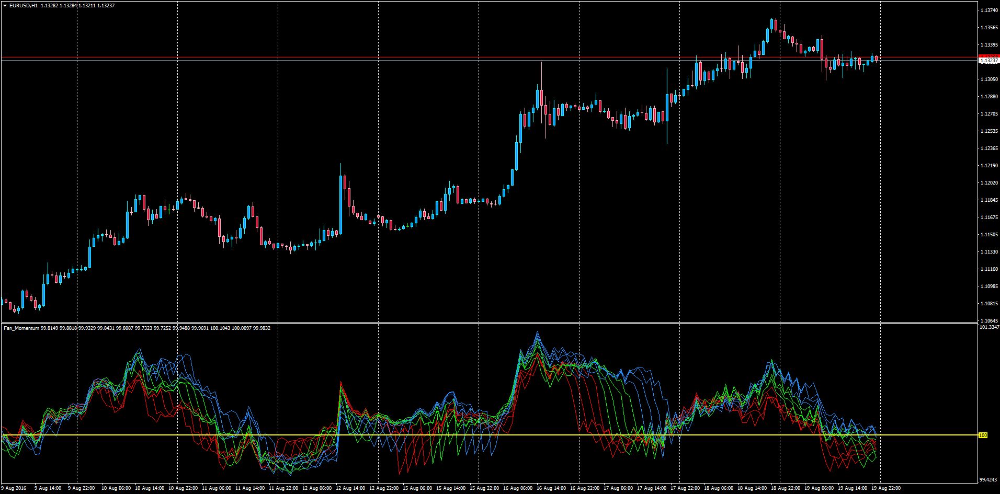

# Fan Momentum with Alerts

> Source: https://fxcodebase.com/code/viewtopic.php?f=38&t=63788  
> Forum: 38 · Topic 63788 · 1 post(s)

---

## Fan Momentum with Alerts

**Apprentice** · Sun Aug 21, 2016 3:52 am

Based on lua.
[viewtopic.php?f=17&t=1102](https://fxcodebase.com/code/viewtopic.php?f=17&t=1102)

Alert Description: Optional Alert when the indicator indentifies a cross of one of the Momentum lines in the fan.

Example
 It will alert "EURUSD (TF): Fan Momenum Up Cross".

 [Fan_Momentum.mq4](files/107720/Fan_Momentum.mq4)
