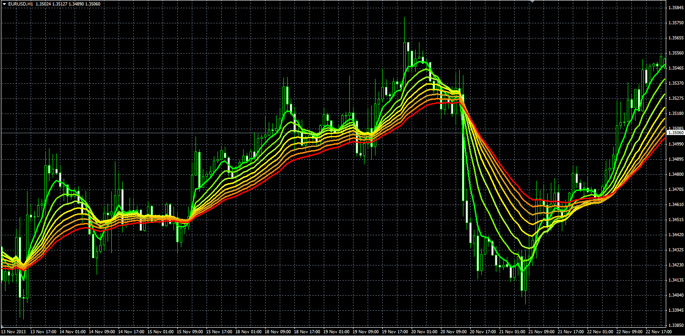
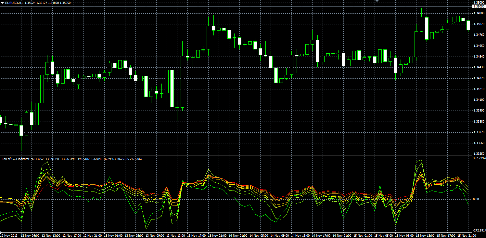
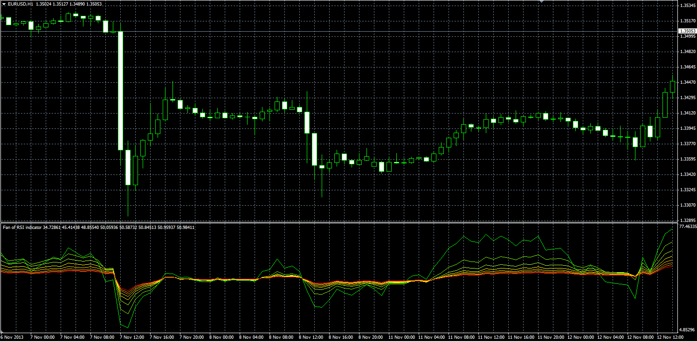
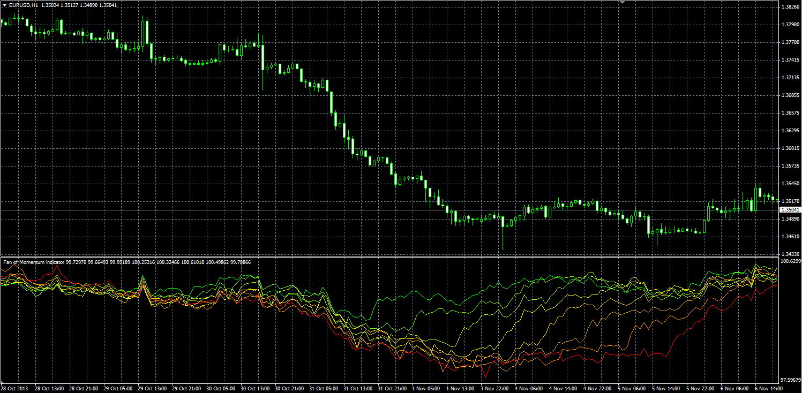
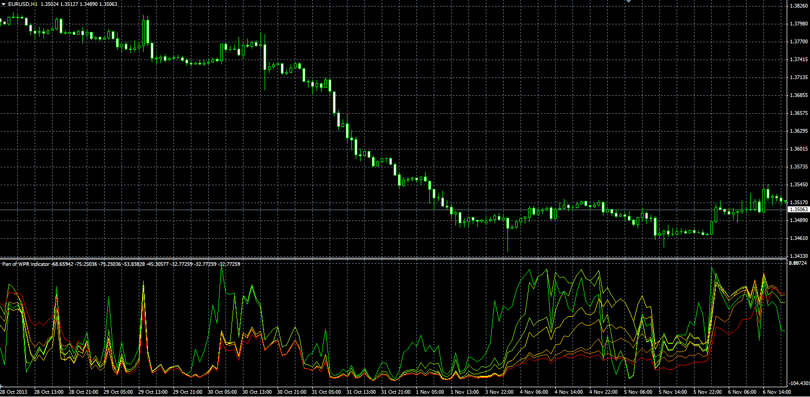

# Fan of MA, CCI, RSI, Momentum, WPR

> Source: https://fxcodebase.com/code/viewtopic.php?f=38&t=59961  
> Forum: 38 · Topic 59961 · 1 post(s)

---

## Fan of MA, CCI, RSI, Momentum, WPR

**Alexander.Gettinger** · Mon Nov 25, 2013 2:14 pm

Unfortunately, the MT4 indicator may have only eight indicator buffers.
Therefore, the number of lines is not specified and is always eight.

**1. Fan of MA.**

 

Download:

 [Fan_MA.mq4](files/91093/Fan_MA.mq4)

**2. Fan of CCI.**

 

Download:

 [Fan_CCI.mq4](files/91093/Fan_CCI.mq4)

**3. Fan of RSI.**

 

Download:

 [Fan_RSI.mq4](files/91093/Fan_RSI.mq4)

**4. Fan of Momentum.**

 

Download:

 [Fan_Momentum.mq4](files/91093/Fan_Momentum.mq4)

**5. Fan of WPR.**

 

Download:

 [Fan_WPR.mq4](files/91093/Fan_WPR.mq4)
