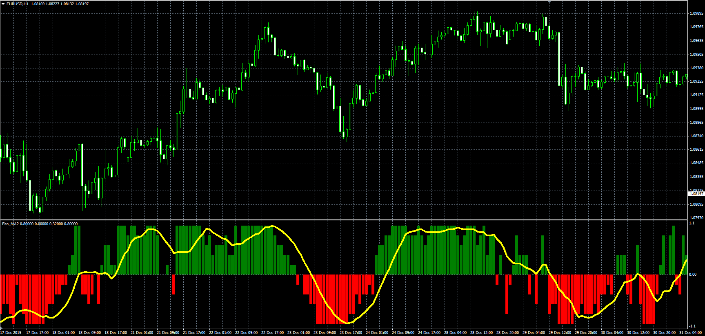
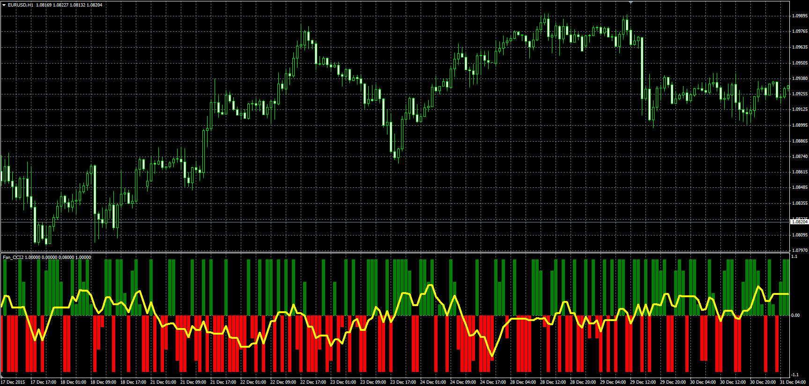
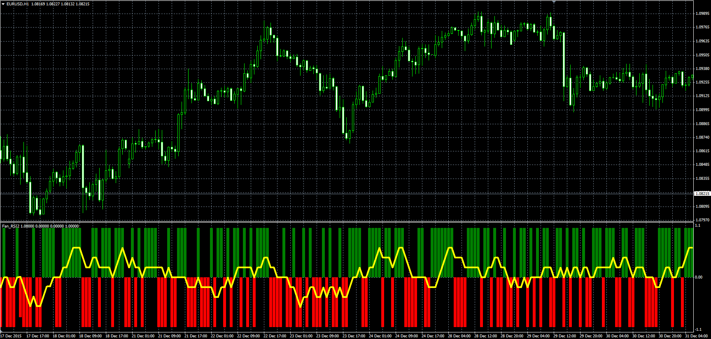

# Fan oscillators

> Source: https://fxcodebase.com/code/viewtopic.php?f=38&t=63067  
> Forum: 38 · Topic 63067 · 1 post(s)

---

## Fan oscillators

**Alexander.Gettinger** · Mon Jan 25, 2016 10:05 am

Oscillators are fan oscillators ([viewtopic.php?f=38&t=59961&p=91093](https://fxcodebase.com/code/viewtopic.php?f=38&t=59961&p=91093)) in maybe more suitable version.
Value of oscillator show relative position line of fan and have range between -1 and 1.

**Fan of MA:**

 

Download:

 [Fan_MA2.mq4](files/104422/Fan_MA2.mq4)

**Fan of CCI:**

 

Download:

 [Fan_CCI2.mq4](files/104422/Fan_CCI2.mq4)

**Fan of RSI:**

 

Download:

 [Fan_RSI2.mq4](files/104422/Fan_RSI2.mq4)
