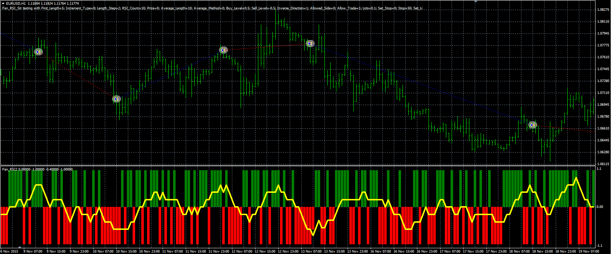

# Fan RSI strategy

> Source: https://fxcodebase.com/code/viewtopic.php?f=38&t=63286  
> Forum: 38 · Topic 63286 · 1 post(s)

---

## Fan RSI strategy

**Alexander.Gettinger** · Wed Mar 23, 2016 12:52 pm

The strategy based on Fan of RSI indicator ([viewtopic.php?f=38&t=63067&p=104422](https://fxcodebase.com/code/viewtopic.php?f=38&t=63067&p=104422)).

Buy condition: Fan RSI crosses over the Buy level.
Sell condition: Fan RSI crosses under the Sell level.

 

Download:

 [Fan_RSI_Str.mq4](files/105421/Fan_RSI_Str.mq4)

Fan_RSI2 indicator ([viewtopic.php?f=38&t=63067&p=104422](https://fxcodebase.com/code/viewtopic.php?f=38&t=63067&p=104422)) should be installed for correct work.
