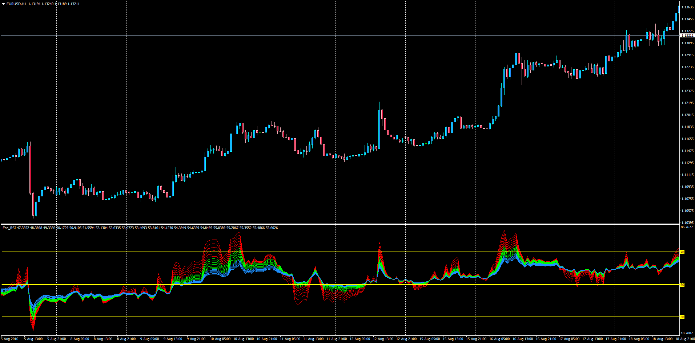

# Fan RSI with Alerts

> Source: https://fxcodebase.com/code/viewtopic.php?f=38&t=63789  
> Forum: 38 · Topic 63789 · 1 post(s)

---

## Fan RSI with Alerts

**Apprentice** · Sun Aug 21, 2016 3:55 am

Based on lua.
[viewtopic.php?f=17&t=1102](https://fxcodebase.com/code/viewtopic.php?f=17&t=1102)

Alert Description: Optional Alert when the indicator indentifies a cross of one of the RSI lines in the fan.
Example
It will alert "EURUSD (TF): Fan RSI Up Cross" .

 [Fan_RSI.mq4](files/107721/Fan_RSI.mq4)
