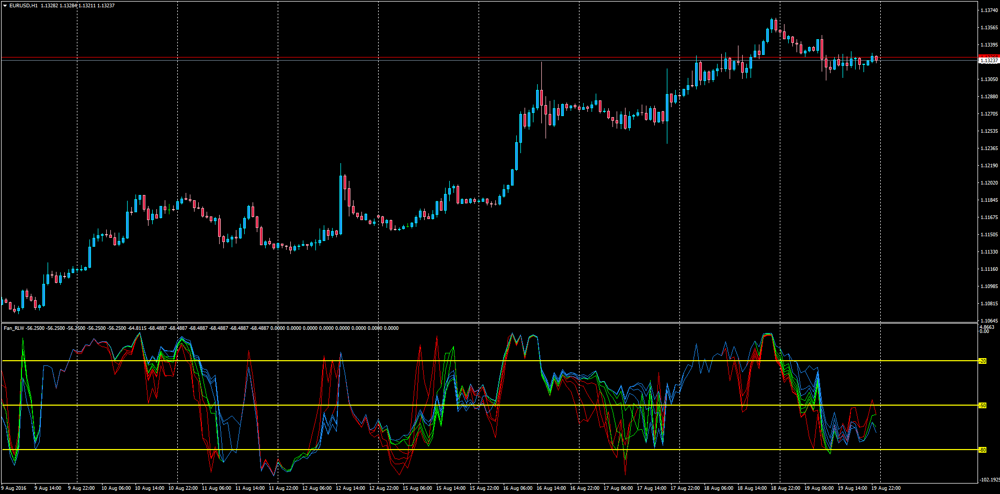

# Fan RWL with Alerts

> Source: https://fxcodebase.com/code/viewtopic.php?f=38&t=63790  
> Forum: 38 · Topic 63790 · 1 post(s)

---

## Fan RWL with Alerts

**Apprentice** · Sun Aug 21, 2016 3:58 am

William's Percent Range RWL Fan with Alerts for MT4

LUA Original: [viewtopic.php?f=17&t=1102&start=10#p91094](https://fxcodebase.com/code/viewtopic.php?f=17&t=1102&start=10#p91094)

Alert Description: Optional Alert when the indicator indentifies a cross of one of the RWL lines in the fan.
Example.
It will alert "EURUSD (TF): Fan RWL Up Cross"

 [Fan_RLW.mq4](files/107722/Fan_RLW.mq4)
